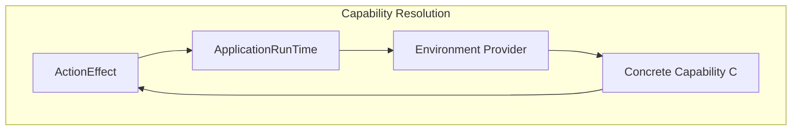
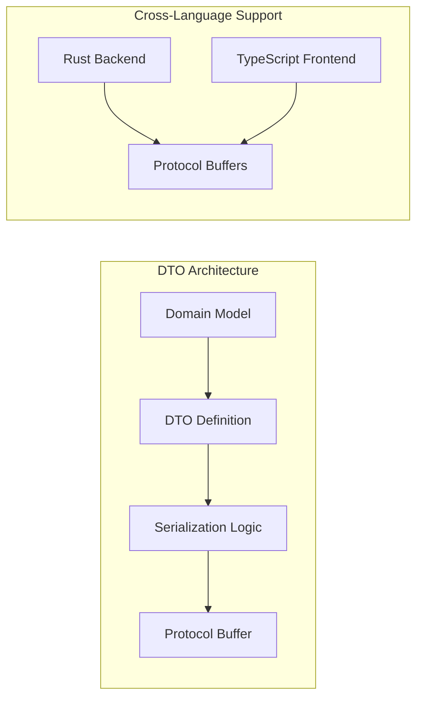
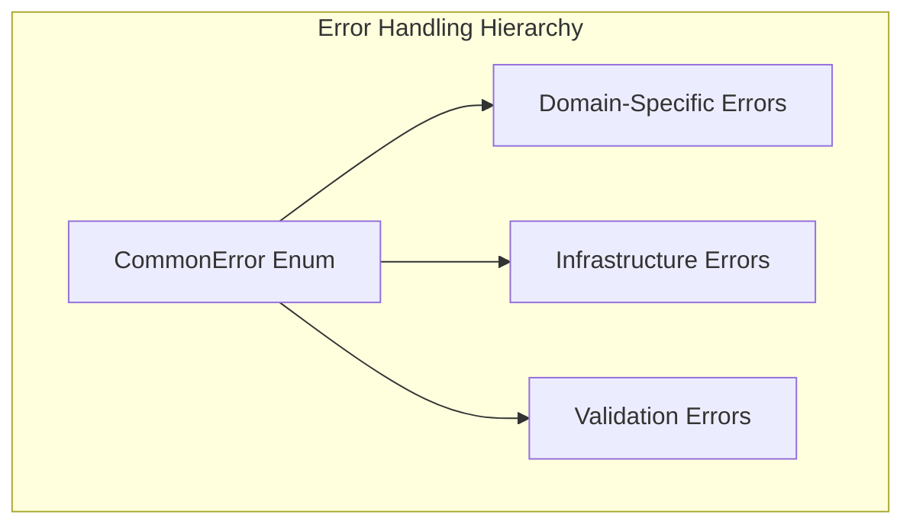
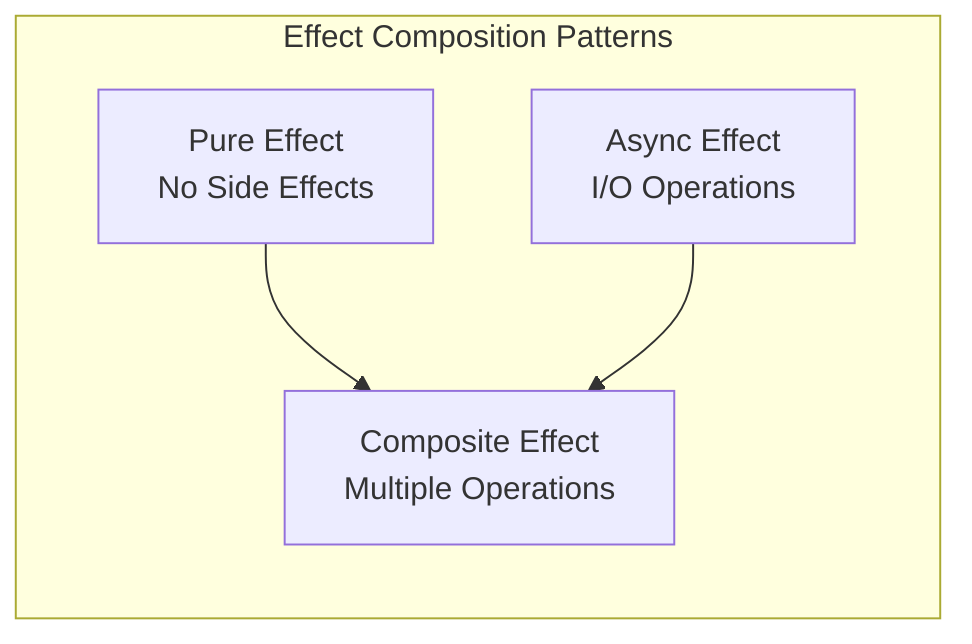
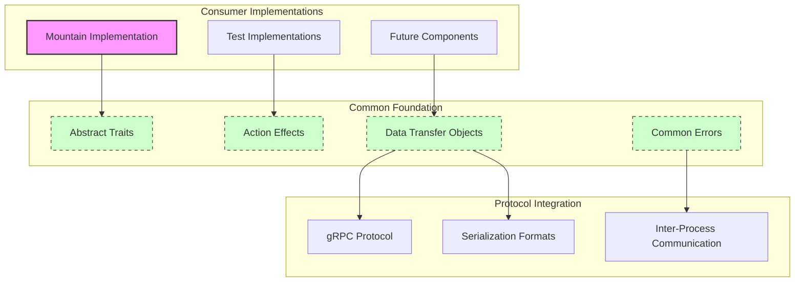
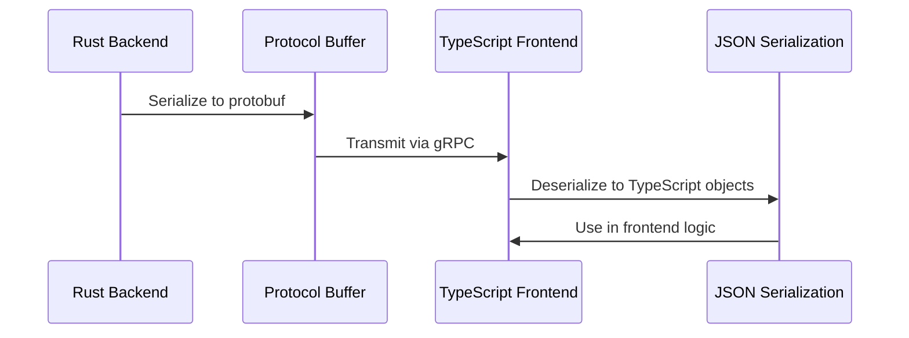
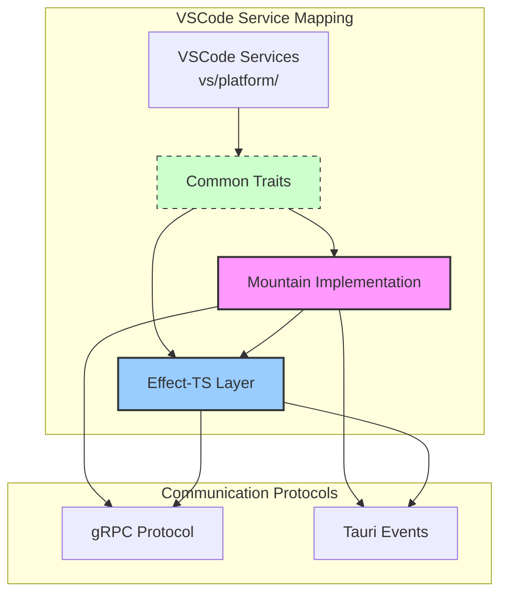
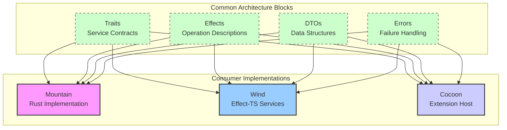

<table>
	<tr>
		<td colspan="1">
			<h3 align="center">
				<picture>
					<source media="(prefers-color-scheme: dark)" srcset="https://editor.land/Dark/Image/GitHub/Land.svg">
					<source media="(prefers-color-scheme: light)" srcset="https://editor.land/Image/GitHub/Land.svg">
					
				</picture>
			</h3>
		</td>
		<td colspan="3" valign="top">
			<h3 align="center"> Common 👨🏻‍🏭</h3>
		</td>
	</tr>
</table>

---

# **Common** 👨🏻‍🏭 Deep Dive & Architecture

This document provides the technical foundation for lifting VSCode services into
the Land ecosystem. `Common` 👨🏻‍🏭 defines the abstract architectural patterns,
service contracts, and data structures that enable type-safe, testable service
implementations across Rust and TypeScript boundaries.

---

## Core Architecture Principles 🏛️

| Principle                    | Description                                                                                                                                          | Key Components Involved                    |
| :--------------------------- | :--------------------------------------------------------------------------------------------------------------------------------------------------- | :----------------------------------------- |
| **Pure Abstraction**         | Define every application capability as abstract `async trait`s without any concrete implementation logic, enforcing strict architectural boundaries. | All `*Provider.rs` and `*Manager.rs` files |
| **Declarative Effects**      | Represent every operation as an `ActionEffect` value, separating operation description from execution for maximum composability and testability.     | `Effect/*`, all effect constructor files   |
| **Trait-Based DI**           | Implement a clean, compile-time dependency injection system using the `Environment` and `Requires` traits for explicit capability declaration.       | `Environment/*`                            |
| **Universal Error Handling** | Provide a single, exhaustive `CommonError` enum that covers all possible failure scenarios across the entire native ecosystem.                       | `Error/`                                   |
| **Contract-First Design**    | Define all data structures (`DTO/*`) and error types (`Error/*`) first, establishing a stable contract for all other components.                     | `DTO/`, `Error/`                           |
| **Minimal Dependencies**     | Maintain minimal dependencies and complete independence from Tauri, gRPC, or any specific application logic, ensuring clean separation.              | `Cargo.toml`                               |

---

## Deep Dive into `Common`'s Components 🔬

### 1. The `ActionEffect` System: Concrete Implementation ⚙️

The `ActionEffect` system implements declarative programming patterns where
operations are described as values rather than executed immediately.

#### **Concrete Effect Definition**

An `ActionEffect<C, E, T>` describes:

- **C**: The capability type required for execution
- **E**: The error type that may result from execution
- **T**: The successful result type

**Type Signature:**

```rust
pub struct ActionEffect<TCapability, TError, TOutput> {
    pub Function: Arc<dyn Fn(TCapability) -> Pin<Box<dyn Future<Output = Result<TOutput, TError>> + Send>> + Send + Sync>,
}
```

#### **Concrete Effect Composition**

Effects can be composed using standard operations:

```rust
// Sequential composition: effect1 then effect2
let sequential_effect = effect1.and_then(|result1| effect2(result1));

// Parallel composition: run effects concurrently
let parallel_effect = effect1.zip(effect2);

// Error recovery: try alternative effect on failure
let resilient_effect = effect.fallback(backup_effect);
```

### 2. Concrete Environment System Architecture 🌐

The `Environment` trait system implements capability-based architecture for
clean dependency management:



#### **Concrete Capability Resolution**

For any `ActionEffect<C, E, T>`, the runtime provides `C` through these steps:

1. **Effect Declaration:** Effects explicitly declare required capabilities
2. **Environment Implementation:** Concrete environments implement required
   traits
3. **Runtime Resolution:** ApplicationRunTime resolves and provides capabilities
4. **Execution:** Effect executes with provided capability

### 3. Concrete DTO System Design 📦

The Data Transfer Object system provides type-safe serialization for IPC
communication:



#### **Concrete DTO Implementation**

DTOs ensure consistent data structures across the Land ecosystem:

- **Bi-directional Mapping:** Domain types map to DTOs and back
- **Protocol Compliance:** DTOs comply with gRPC and serialization requirements
- **Type Safety:** Compile-time validation of data structures
- **Performance:** Efficient serialization for high-frequency operations

### 4. Concrete Error System Architecture 🚨

The `CommonError` enum provides comprehensive error handling:



#### **Concrete Error Recovery Patterns**

- **Automatic Retry:** Retry operations with exponential backoff
- **Graceful Fallback:** Provide alternative implementations on failure
- **User Notification:** Inform users of errors when appropriate
- **Logging:** Comprehensive error logging for debugging

---

## Concrete Technical Architecture 🏗️

### Core Architectural Components 🧱

#### 1. Concrete Effect Composition Architecture

`Common` enables sophisticated effect composition through concrete patterns:



**Concrete Effect Operations:**

- **Mapping:** Transform effect results without executing
- **Sequential Composition:** Chain effects in order
- **Parallel Composition:** Execute effects concurrently
- **Error Handling:** Recover from failures gracefully

#### 2. Concrete Dependency Injection Architecture

`Common` implements clean dependency injection through trait bounds:

```rust
// Service trait definition
#[async_trait]
pub trait FileSystemReader: Send + Sync {
    async fn ReadFile(&self, path: &PathBuf) -> Result<Vec<u8>, CommonError>;
}

// Effect requiring the trait
pub fn ReadFile_effect(path: PathBuf) -> ActionEffect<Arc<dyn FileSystemReader>, CommonError, Vec<u8>> {
    ActionEffect::new(move |fs: Arc<dyn FileSystemReader>| {
        Box::pin(async move { fs.ReadFile(&path).await })
    })
}
```

### Concrete Technical Implementation 🔩

#### Performance Characteristics: Effect Execution Overhead

**Measured Overhead:**

- **Effect Creation:** ~10ns (heap allocation)
- **Capability Resolution:** ~5ns (trait method lookup)
- **Execution Wrapper:** ~2ns (future boxing)
- **Total Overhead:** ~17ns per effect

**Concrete Benefits:**

- **Type Safety:** Full Rust type checking
- **Testability:** Mockable effects for unit testing
- **Maintainability:** Clear separation of concerns
- **Composability:** Reusable effect building blocks

#### Concrete Type Safety Implementation

The type system prevents runtime capability errors through:

1. **Trait Bounds:** Effects require specific trait implementations
2. **Environment Constraints:** Runtime environments must satisfy trait bounds
3. **Compile-Time Verification:** Invalid compositions fail to compile
4. **Runtime Safety:** Successful compilation guarantees capability availability

### Ecosystem Integration Mapping 🗺️



### Concrete Integration Patterns 🔗

#### Effect-Based Testing Architecture


**Concrete Testing Strategies:**

- **Unit Tests:** Isolated service testing with mocked dependencies
- **Integration Tests:** Full system testing with real implementations
- **Property Tests:** Verify effect properties across input ranges

#### Cross-Platform Serialization Patterns



---

## Concrete VSCode Service Lifting Patterns 🔧

### Service Migration Strategy 🔄

`Common` provides the foundation for lifting VSCode services through:

#### 1. Service Interface Definition

```rust
// VSCode service interface lifted to Common
#[async_trait]
pub trait WorkspaceService: Send + Sync {
    async fn get_workspace_folders(&self) -> Result<Vec<WorkspaceFolder>, CommonError>;
    async fn UpdateWorkspaceFolders(&self, folders: Vec<WorkspaceFolder>) -> Result<(), CommonError>;
}
```

#### 2. Effect Constructor Patterns

```rust
// Effect constructor for VSCode service operations
pub fn get_workspace_folders_effect() -> ActionEffect<Arc<dyn WorkspaceService>, CommonError, Vec<WorkspaceFolder>> {
    ActionEffect::new(move |service: Arc<dyn WorkspaceService>| {
        Box::pin(async move { service.get_workspace_folders().await })
    })
}
```

#### 3. DTO Definition for VSCode Types

```rust
// VSCode WorkspaceFolder lifted to Common DTO
#[derive(Serialize, Deserialize, Clone, Debug)]
pub struct WorkspaceFolderDTO {
    pub uri: String,
    pub name: String,
    pub index: u32,
}
```

### Concrete Service Integration Examples 📋

#### File System Service Lifting

```rust
// VSCode file system service interface
#[async_trait]
pub trait FileSystemService: Send + Sync {
    async fn ReadFile(&self, uri: &str) -> Result<Vec<u8>, CommonError>;
    async fn WriteFile(&self, uri: &str, content: &[u8]) -> Result<(), CommonError>;
    async fn stat(&self, uri: &str) -> Result<FileStat, CommonError>;
}

// File system effect constructors
pub fn ReadFile_effect(uri: String) -> ActionEffect<Arc<dyn FileSystemService>, CommonError, Vec<u8>> {
    ActionEffect::new(move |fs: Arc<dyn FileSystemService>| {
        Box::pin(async move { fs.ReadFile(&uri).await })
    })
}
```

#### Configuration Service Lifting

```rust
// VSCode configuration service interface
#[async_trait]
pub trait ConfigurationService: Send + Sync {
    async fn GetConfiguration(&self, section: Option<&str>) -> Result<Value, CommonError>;
    async fn UpdateConfiguration(&self, key: &str, value: Value) -> Result<(), CommonError>;
}

// Configuration effect constructors
pub fn GetConfiguration_effect(section: Option<String>) -> ActionEffect<Arc<dyn ConfigurationService>, CommonError, Value> {
    ActionEffect::new(move |config: Arc<dyn ConfigurationService>| {
        Box::pin(async move { config.GetConfiguration(section.as_deref()).await })
    })
}
```

### Concrete VSCode Service Lifting Architecture 🏗️



#### Service Migration Table

| VSCode Service          | Common Trait           | Mountain Implementation | Effect-TS Layer        |
| :---------------------- | :--------------------- | :---------------------- | :--------------------- |
| `IFileService`          | `FileSystemService`    | `MountainFileSystem`    | `FileService`          |
| `IWorkspaceService`     | `WorkspaceService`     | `MountainWorkspace`     | `WorkspaceService`     |
| `IConfigurationService` | `ConfigurationService` | `MountainConfiguration` | `ConfigurationService` |
| `ICommandService`       | `CommandService`       | `MountainCommand`       | `CommandService`       |
| `IDocumentService`      | `DocumentProvider`     | `MountainDocument`      | `DocumentService`      |

### Component Block Map 🧩



## Performance Optimization Strategies ⚡

### 1. Zero-Cost Abstractions 🔮

- **Inline Optimization:** Effect constructors marked `#[inline]` for direct
  embedding
- **Generic Specialization:** Monomorphization creates specialized versions
- **Stack Allocation:** Small effects avoid heap allocation

### 2. Memory Management Optimization 🧠

- **Arena Allocation:** Related effects use arena allocation for locality
- **Object Pooling:** Frequently used effect types are pooled
- **Cache-Friendly Layout:** Data structures optimized for CPU cache

### 3. Concurrency Optimization 🔄

- **Send + Sync Bounds:** Effects designed for seamless cross-thread usage
- **Atomic Reference Counting:** Efficient `Arc` usage with minimal overhead
- **Lock-Free Patterns:** Internal data structures use lock-free algorithms

## Development Guidelines 📖

### Adding New Services ➕

When adding new services to `Common`, follow these concrete patterns:

1. **Define Service Interface:** Create Rust trait matching VSCode service
   interface
2. **Implement Effect Constructors:** Create ActionEffect constructors for
   service operations
3. **Define DTOs:** Create serializable DTOs for cross-language communication
4. **Define Errors:** Add appropriate error variants to CommonError

### Concrete Usage Patterns 💡

#### Custom Effect Creation

```rust
use Common::FileSystem;
use Common::Effect::ActionEffect;
use std::sync::Arc;

// Advanced effect composition
let complex_effect = FileSystem::ReadFile(path.clone())
    .and_then(|content| FileSystem::WriteFile(other_path, content))
    .map(|_| println!("File operation completed successfully"));

// Effect with custom error handling
let resilient_effect = FileSystem::ReadFile(path)
    .recover_with(|error| {
        log::warn!("File read failed: {}", error);
        ActionEffect::pure(Vec::new()) // Fallback to empty content
    });
```

#### Performance Monitoring Integration

```rust
// Monitor effect execution performance
let monitored_effect = effect
    .with_execution_timing()
    .with_resource_usage_tracking();

// Real-time metrics collection
let metrics = {
    executions_per_second: u64,
    average_latency_ms: f64,
    error_rate: f64
};
```

`Common` represents the foundational layer for lifting VSCode services into the
Land ecosystem, providing the abstract contracts and patterns that enable
type-safe, testable, and maintainable service implementations across Rust and
TypeScript boundaries.
