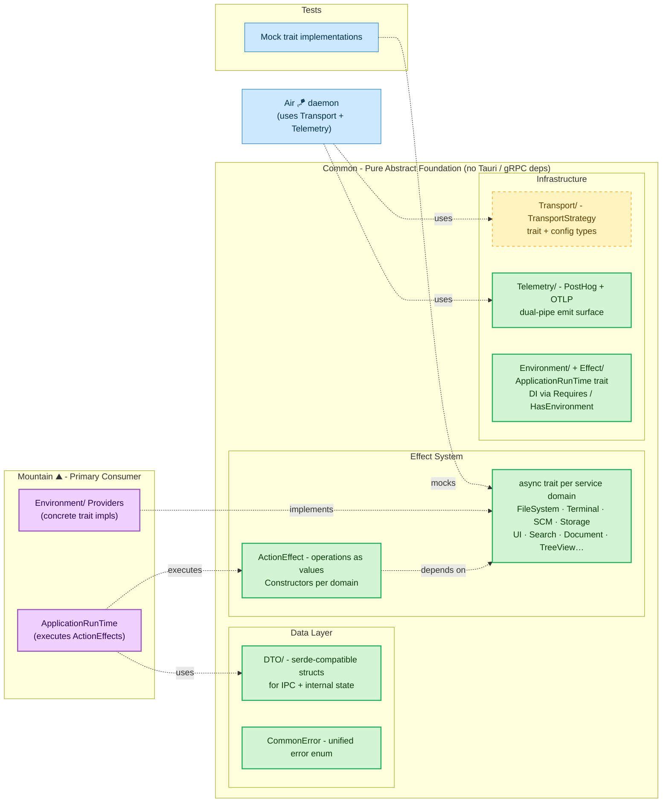

# **Common**&#x2001;🧩

<table>
	<tr>
		<td>
			<a href="https://GitHub.Com/CodeEditorLand/Common" target="_blank">
				<picture>
					<source media="(prefers-color-scheme: dark)" srcset="https://img.shields.io/github/last-commit/CodeEditorLand/Common?label=Last-commit&color=black&labelColor=black&logoColor=white&logoWidth=0" />
					<source media="(prefers-color-scheme: light)" srcset="https://img.shields.io/github/last-commit/CodeEditorLand/Common?label=Last-commit&color=white&labelColor=white&logoColor=black&logoWidth=0" />
					
				</picture>
			</a>
			<br />
			<a href="https://GitHub.Com/CodeEditorLand/Common" target="_blank">
				<picture>
					<source media="(prefers-color-scheme: dark)" srcset="https://img.shields.io/github/issues/CodeEditorLand/Common?label=Issues&color=black&labelColor=black&logoColor=white&logoWidth=0" />
					<source media="(prefers-color-scheme: light)" srcset="https://img.shields.io/github/issues/CodeEditorLand/Common?label=Issues&color=white&labelColor=white&logoColor=black&logoWidth=0" />
					
				</picture>
			</a>
		</td>
		<td>
			<a href="https://github.com/CodeEditorLand/Common" target="_blank">
				<picture>
					<source media="(prefers-color-scheme: dark)" srcset="https://img.shields.io/github/stars/CodeEditorLand/Common?style=flat&label=Star&logo=github&color=black&labelColor=black&logoColor=white&logoWidth=0" />
					<source media="(prefers-color-scheme: light)" srcset="https://img.shields.io/github/stars/CodeEditorLand/Common?style=flat&label=Star&logo=github&color=white&labelColor=white&logoColor=black&logoWidth=0" />
					
				</picture>
			</a>
			<br />
			<a href="https://GitHub.Com/CodeEditorLand/Common" target="_blank">
				<picture>
					<source media="(prefers-color-scheme: dark)" srcset="https://img.shields.io/github/downloads/CodeEditorLand/Common?label=Downloads&color=black&labelColor=black&logoColor=white&logoWidth=0" />
					<source media="(prefers-color-scheme: light)" srcset="https://img.shields.io/github/downloads/CodeEditorLand/Common?label=Downloads&color=white&labelColor=white&logoColor=black&logoWidth=0" />
					
				</picture>
			</a>
		</td>
	</tr>
</table>

The Pure Abstract Foundation for Land&#x2001;🏞️

> **VS Code's codebase imports concrete implementations directly. Testing a
> single component means mocking entire subsystems. There is no dependency
> injection at the architecture level.**

_"Mock any service and test any element in isolation, no running editor
required."_

[](https://github.com/CodeEditorLand/Common/tree/Current/LICENSE)
[](https://www.rust-lang.org/)
[](https://www.rust-lang.org/)
[](https://www.rust-lang.org/)
[](https://crates.io/crates/land-common)

[Rust API Documentation](https://rust.documentation.common.editor.land/)

---

## Overview

**Common** 🧩 is the architectural core of the Land Code Editor's native
backend. It provides a pure, abstract foundation with **no concrete
implementations** — defining the application's "language" through `async trait`s
per service domain, an `ActionEffect` declarative system, Data Transfer Objects
(DTOs) for IPC, a unified `CommonError` enum, a transport-agnostic communication
layer, and a telemetry dual-pipe.

The entire `Mountain` backend and any future native components are built by
implementing the traits and consuming the effects defined in this crate. By
defining all application capabilities as abstract `trait`s, it enforces clean
architectural boundaries, maximizes testability through mock implementations,
and ensures consistent data contracts across the entire native ecosystem.

---

## Key Features&#x2001;⚙️

**Declarative `ActionEffect` System** — Operations are treated as data
structures rather than direct function calls. Effects are constructed as values
that describe the desired side effect and are then passed to an
`ApplicationRunTime` for execution. This enables composition, testing, and
controlled execution in a single unified pattern. Instead of writing a function
that immediately performs I/O, you call a function that _returns a description
of that effect_.

**Compile-Time Dependency Injection** — The `Environment` and `Requires` traits
handle DI at compile time. Components declare their service needs without
coupling to specific implementations. All core application services are defined
as `async trait`s, enforcing an asynchronous-first architecture across the
entire system.

**DTO Library for IPC** — Every data structure used for IPC communication with
`Cocoon` and internal state management in `Mountain` is defined here. All types
are `serde`-compatible, forming the stable contract between all Land components.

**Unified Error Handling** — A single `CommonError` enum covers every possible
failure across all service domains — `FileSystem`, `Terminal`, `SCM`,
`LanguageFeature`, `Transport`, and more. Error handling is consistent and
predictable everywhere.

**Transport-Agnostic Communication** — The `Transport/` layer defines a
`TransportStrategy` trait. Concrete implementations (`gRPCTransport`,
`IPCTransport`, `WASMTransport`, `MistTransport`) live in `Grove`.

**Dual-Pipe Telemetry** — The `Telemetry/` module provides a shared
`PostHog` + `OTLP` emit surface consumed by all `Rust` sidecars.

**Minimal Dependencies** — This crate depends only on `serde`, `tokio`,
`async-trait`, and a handful of foundational crates. It has zero knowledge of
`Tauri`, `gRPC`, or any specific application logic.

---

## Core Architecture Principles&#x2001;🏗️

| Principle          | Description                                                                                                                                    | Key Components Involved                    |
| :----------------- | :--------------------------------------------------------------------------------------------------------------------------------------------- | :----------------------------------------- |
| **Abstraction**    | Define every application capability as an abstract `async trait`. Never include concrete implementation logic.                                 | All `*Provider.rs` and `*Manager.rs` files |
| **Declarativism**  | Represent every operation as an `ActionEffect` value. The crate provides constructor functions for these effects.                              | `Effect/*`, all effect constructor files   |
| **Composability**  | The `ActionEffect` system and trait-based DI are designed to be composed, allowing complex workflows to be built from simple, reusable pieces. | `Environment/*`, `Effect/*`                |
| **Contract-First** | Define all data structures (`DTO/*`) and error types (`Error/*`) first. These form the stable contract for all other components.               | `DTO/`, `Error/`                           |
| **Purity**         | This crate has minimal dependencies and is completely independent of Tauri, gRPC, or any specific application logic.                           | `Cargo.toml`                               |

---

## System Architecture&#x2001;



**Dependency flow:**

| Path | Relationship | Use Case |
|------|-------------|----------|
| `Mountain` → `Common` | Implements traits, consumes effects | Primary consumer of all service definitions |
| `Grove` → `Common` transport layer | Implements `TransportStrategy` | `gRPC`, `IPC`, `WASM`, `Mist` transports |
| `Air` → `Common` transport + telemetry | Uses `Transport` and `Telemetry` modules | Background daemon communication |
| Sidecars → `Common` telemetry | Consumes `PostHog` + `OTLP` emit surface | Shared telemetry across all `Rust` sidecars |
| Mock tests → `Common` traits | Implements mock providers | Fast, isolated unit tests |
| `Cocoon` ↔ `Common` | Shares DTOs via `serde` | IPC data contract compatibility |

---

## Key Components

| Component               | Path                              | Description                                                        |
| ----------------------- | --------------------------------- | ------------------------------------------------------------------ |
| Library Root            | `Source/Library.rs`               | Crate root, declares all modules.                                  |
| Environment             | `Source/Environment/`             | The core DI system (Environment, Requires, HasEnvironment traits). |
| Effect                  | `Source/Effect/`                  | The ActionEffect system (ActionEffect, ApplicationRunTime traits). |
| Error                   | `Source/Error/`                   | The universal CommonError enum.                                    |
| DTO                     | `Source/DTO/`                     | Shared Data Transfer Objects (re-exports from service modules).    |
| Utility                 | `Source/Utility/`                 | Utility functions (e.g., Serialization).                           |
| Command                 | `Source/Command/`                 | Command management service.                                        |
| Configuration           | `Source/Configuration/`           | Configuration provider service.                                    |
| CustomEditor            | `Source/CustomEditor/`            | Custom editor provider service.                                    |
| Debug                   | `Source/Debug/`                   | Debug service.                                                     |
| Diagnostic              | `Source/Diagnostic/`              | Diagnostic manager service.                                        |
| Document                | `Source/Document/`                | Document provider service.                                         |
| ExtensionManagement     | `Source/ExtensionManagement/`     | Extension management service.                                      |
| FileSystem              | `Source/FileSystem/`              | File system read/write service.                                    |
| IPC                     | `Source/IPC/`                     | Inter-process communication service.                               |
| Keybinding              | `Source/Keybinding/`              | Keybinding provider service.                                       |
| LanguageFeature         | `Source/LanguageFeature/`         | Language feature provider registry.                                |
| Output                  | `Source/Output/`                  | Output channel manager service.                                    |
| Search                  | `Source/Search/`                  | Search provider service.                                           |
| Secret                  | `Source/Secret/`                  | Secret storage provider service.                                   |
| SourceControlManagement | `Source/SourceControlManagement/` | Source control management service.                                 |
| StatusBar               | `Source/StatusBar/`               | Status bar provider service.                                       |
| Storage                 | `Source/Storage/`                 | Storage provider service.                                          |
| Synchronization         | `Source/Synchronization/`         | Synchronization provider service.                                  |
| Telemetry               | `Source/Telemetry/`               | Telemetry service (dual-pipe PostHog + OTLP).                      |
| Terminal                | `Source/Terminal/`                | Terminal provider service.                                         |
| Testing                 | `Source/Testing/`                 | Test controller service.                                           |
| Transport               | `Source/Transport/`               | Transport-agnostic communication layer.                            |
| TreeView                | `Source/TreeView/`                | Tree view provider service.                                        |
| UserInterface           | `Source/UserInterface/`           | User interface provider service.                                   |
| Webview                 | `Source/Webview/`                 | Webview provider service.                                          |
| Workspace               | `Source/Workspace/`               | Workspace provider service.                                        |

---

## Project Structure&#x2001;🗺️

```
Element/Common/
├── Source/
│   ├── Library.rs              # Crate root, declares all modules
│   ├── Command/                # Command management service
│   │   ├── mod.rs
│   │   ├── CommandExecutor.rs
│   │   ├── ExecuteCommand.rs
│   │   ├── GetAllCommands.rs
│   │   ├── RegisterCommand.rs
│   │   └── UnregisterCommand.rs
│   ├── Configuration/          # Configuration provider service
│   │   ├── mod.rs
│   │   ├── ConfigurationProvider.rs
│   │   ├── ConfigurationInspector.rs
│   │   ├── GetConfiguration.rs
│   │   ├── InspectConfiguration.rs
│   │   ├── UpdateConfiguration.rs
│   │   └── DTO/
│   ├── CustomEditor/           # Custom editor provider service
│   │   ├── mod.rs
│   │   └── CustomEditorProvider.rs
│   ├── Debug/                  # Debug service
│   │   ├── mod.rs
│   │   └── DebugService.rs
│   ├── Diagnostic/             # Diagnostic manager service
│   │   ├── mod.rs
│   │   ├── DiagnosticManager.rs
│   │   ├── ClearDiagnostics.rs
│   │   ├── GetAllDiagnostics.rs
│   │   └── SetDiagnostics.rs
│   ├── Document/               # Document provider service
│   │   ├── mod.rs
│   │   ├── DocumentProvider.rs
│   │   ├── ApplyDocumentChanges.rs
│   │   ├── OpenDocument.rs
│   │   ├── SaveAllDocuments.rs
│   │   ├── SaveDocument.rs
│   │   └── SaveDocumentAs.rs
│   ├── DTO/                    # Shared Data Transfer Objects
│   │   ├── mod.rs
│   │   └── WorkspaceEditDTO.rs
│   ├── Effect/                 # ActionEffect system
│   │   ├── mod.rs
│   │   ├── ActionEffect.rs
│   │   ├── ApplicationRunTime.rs
│   │   └── ExecuteEffect.rs
│   ├── Environment/            # Dependency injection system
│   │   ├── mod.rs
│   │   ├── Environment.rs
│   │   ├── HasEnvironment.rs
│   │   └── Requires.rs
│   ├── Error/                  # Unified error handling
│   │   ├── mod.rs
│   │   └── CommonError.rs
│   ├── ExtensionManagement/    # Extension management service
│   │   ├── mod.rs
│   │   └── ExtensionManagementService.rs
│   ├── FileSystem/             # File system read/write service
│   │   ├── mod.rs
│   │   ├── FileSystemReader.rs
│   │   ├── FileSystemWriter.rs
│   │   ├── FileWatcherProvider.rs
│   │   ├── Copy.rs
│   │   ├── CreateDirectory.rs
│   │   ├── CreateFile.rs
│   │   ├── Delete.rs
│   │   ├── ReadDirectory.rs
│   │   ├── ReadFile.rs
│   │   ├── Rename.rs
│   │   ├── StatFile.rs
│   │   ├── WriteFileBytes.rs
│   │   ├── WriteFileString.rs
│   │   └── DTO/
│   ├── IPC/                    # Inter-process communication service
│   │   ├── mod.rs
│   │   ├── Channel.rs
│   │   ├── IPCProvider.rs
│   │   ├── EstablishHostConnection.rs
│   │   ├── ProxyCallToSideCar.rs
│   │   ├── SendNotificationToSideCar.rs
│   │   ├── SendRequestToSideCar.rs
│   │   ├── SkyEvent.rs
│   │   └── DTO/
│   ├── Keybinding/             # Keybinding provider service
│   │   ├── mod.rs
│   │   └── KeybindingProvider.rs
│   ├── LanguageFeature/        # Language feature provider registry
│   │   ├── mod.rs
│   │   ├── LanguageFeatureProviderRegistry.rs
│   │   ├── RegisterProvider.rs
│   │   ├── UnregisterProvider.rs
│   │   ├── ProvideCallHierarchy.rs
│   │   ├── ProvideCodeActions.rs
│   │   ├── ProvideCodeLenses.rs
│   │   ├── ProvideCompletions.rs
│   │   ├── ProvideDefinition.rs
│   │   ├── ProvideDocumentFormatting.rs
│   │   ├── ProvideDocumentHighlights.rs
│   │   ├── ProvideDocumentSymbols.rs
│   │   ├── ProvideFoldingRanges.rs
│   │   ├── ProvideHover.rs
│   │   ├── ProvideInlayHints.rs
│   │   ├── ProvideLinkedEditingRanges.rs
│   │   ├── ProvideOnTypeFormatting.rs
│   │   ├── ProvideReferences.rs
│   │   ├── ProvideRenameEdits.rs
│   │   ├── ProvideSelectionRanges.rs
│   │   ├── ProvideSemanticTokens.rs
│   │   ├── ProvideSignatureHelp.rs
│   │   ├── ProvideTypeHierarchy.rs
│   │   ├── ProvideWorkspaceSymbols.rs
│   │   └── DTO/
│   ├── Output/                 # Output channel manager service
│   │   ├── mod.rs
│   │   ├── OutputChannelManager.rs
│   │   ├── AppendToOutputChannel.rs
│   │   ├── ClearOutputChannel.rs
│   │   ├── CloseOutputChannelView.rs
│   │   ├── DisposeOutputChannel.rs
│   │   ├── RegisterOutputChannel.rs
│   │   ├── ReplaceOutputChannelContent.rs
│   │   └── RevealOutputChannel.rs
│   ├── Search/                 # Search provider service
│   │   ├── mod.rs
│   │   └── SearchProvider.rs
│   ├── Secret/                 # Secret storage provider service
│   │   ├── mod.rs
│   │   ├── SecretProvider.rs
│   │   ├── DeleteSecret.rs
│   │   ├── GetSecret.rs
│   │   └── StoreSecret.rs
│   ├── SourceControlManagement/ # Source control management service
│   │   ├── mod.rs
│   │   ├── SourceControlManagementProvider.rs
│   │   └── DTO/
│   ├── StatusBar/              # Status bar provider service
│   │   ├── mod.rs
│   │   ├── StatusBarProvider.rs
│   │   └── DTO/
│   ├── Storage/                # Storage provider service
│   │   ├── mod.rs
│   │   ├── StorageProvider.rs
│   │   ├── GetStorageItem.rs
│   │   └── SetStorageItem.rs
│   ├── Synchronization/        # Synchronization provider service
│   │   ├── mod.rs
│   │   └── SynchronizationProvider.rs
│   ├── Telemetry/              # Telemetry service (PostHog + OTLP)
│   │   ├── mod.rs
│   │   ├── CaptureError.rs
│   │   ├── CaptureEvent.rs
│   │   ├── CaptureSession.rs
│   │   ├── Client.rs
│   │   ├── Configuration.rs
│   │   ├── DistinctId.rs
│   │   ├── EmitOTLPSpan.rs
│   │   ├── Initialize.rs
│   │   ├── IsAllowed.rs
│   │   ├── Tier.rs
│   │   └── Traceparent.rs
│   ├── Terminal/               # Terminal provider service
│   │   ├── mod.rs
│   │   ├── TerminalProvider.rs
│   │   └── CreateTerminal.rs
│   ├── Testing/                # Test controller service
│   │   ├── mod.rs
│   │   └── TestController.rs
│   ├── Transport/              # Transport-agnostic communication layer
│   │   ├── mod.rs
│   │   ├── TransportStrategy.rs
│   │   ├── TransportConfig.rs
│   │   ├── TransportError.rs
│   │   ├── CircuitBreaker.rs
│   │   ├── Metrics.rs
│   │   ├── Registry/
│   │   ├── Retry.rs
│   │   ├── UnifiedRequest.rs
│   │   ├── UnifiedResponse.rs
│   │   ├── gRPC.rs
│   │   ├── IPC.rs
│   │   ├── WASM.rs
│   │   ├── Common/
│   │   └── DTO/
│   ├── TreeView/               # Tree view provider service
│   │   ├── mod.rs
│   │   ├── TreeViewProvider.rs
│   │   └── DTO/
│   ├── UserInterface/          # User interface provider service
│   │   ├── mod.rs
│   │   ├── UserInterfaceProvider.rs
│   │   ├── ShowInputBox.rs
│   │   ├── ShowMessage.rs
│   │   ├── ShowOpenDialog.rs
│   │   ├── ShowQuickPick.rs
│   │   ├── ShowSaveDialog.rs
│   │   └── DTO/
│   ├── Utility/                # Utility functions
│   │   ├── mod.rs
│   │   └── Serialization.rs
│   ├── Webview/                # Webview provider service
│   │   ├── mod.rs
│   │   ├── WebviewProvider.rs
│   │   └── DTO/
│   └── Workspace/              # Workspace provider service
│       ├── mod.rs
│       ├── WorkspaceProvider.rs
│       ├── WorkspaceEditApplier.rs
│       ├── ApplyWorkspaceEdit.rs
│       ├── FindFilesInWorkspace.rs
│       ├── GetWorkspaceConfigurationPath.rs
│       ├── GetWorkspaceFolderInfo.rs
│       ├── GetWorkspaceFoldersInfo.rs
│       ├── GetWorkspaceName.rs
│       ├── IsWorkspaceTrusted.rs
│       ├── OpenFile.rs
│       └── RequestWorkspaceTrust.rs
├── Documentation/
│   ├── GitHub/
│   │   ├── DeepDive.md         # ActionEffect system deep dive
│   │   └── Architecture.md     # Internal architecture overview
│   └── Rust/doc/               # Cargo doc output
├── TypeScript/
│   ├── Function/               # Effect constructors (TypeScript)
│   └── Interface/              # Service interfaces (TypeScript)
├── Source/                     # TypeScript shared runtime
│   ├── EffectSmol.ts           # Lightweight effect runtime
│   ├── PubSub.ts               # Pub/sub bus
│   ├── Ref.ts                  # Mutable references
│   ├── Result.ts               # Result type
│   ├── Errors.ts               # Error types
│   └── Container.ts            # DI container
├── build.rs                    # Cargo build script
├── Cargo.toml
├── CHANGELOG.md
├── LICENSE
└── README.md
```

---

## In the Land Project

`Common` is the foundational layer upon which the entire native backend is
built. It has no knowledge of its consumers, but they are entirely dependent on
it.

- **Mountain** 🏔️ - Primary consumer: implements traits with concrete
  `Environment/` providers, executes `ActionEffect`s via `ApplicationRunTime`
- **Air** 🪁 - Background daemon: uses `Transport` and `Telemetry` modules
- **Tests** - Mock trait implementations for unit testing

---

## Getting Started

### Installation

`Common` is intended to be used as a local path dependency within the `Land`
workspace. In `Mountain`'s `Cargo.toml`:

```toml
[dependencies]
Common = { path = "../Common" }
```

### Usage

1. **Implement a Trait:** In `Mountain/Source/Environment/`, provide the
   concrete implementation for a `Common` trait.

```rust
// In Mountain/Source/Environment/FileSystemProvider.rs

use CommonLibrary::FileSystem::{FileSystemReader, FileSystemWriter};

#[async_trait]
impl FileSystemReader for MountainEnvironment {
    async fn ReadFile(&self, Path: &PathBuf) -> Result<Vec<u8>, CommonError> {
        // ... actual tokio::fs call ...
    }
    // ...
}
```

2. **Create and Execute an Effect:** In business logic, create and run an
   effect.

```rust
// In a Mountain service or command

use CommonLibrary::FileSystem;
use CommonLibrary::Effect::ApplicationRunTime;

async fn SomeLogic(Runtime: Arc<impl ApplicationRunTime>) {
    let Path = PathBuf::from("/my/file.txt");
    let ReadEffect = FileSystem::ReadFile(Path);

    match Runtime.Run(ReadEffect).await {
        Ok(Content) => info!("File content length: {}", Content.len()),
        Err(Error) => error!("Failed to read file: {:?}", Error),
    }
}
```

---

## Security&#x2001;🔒

Common enforces security at the architectural level:

| Layer | Mechanism |
|-------|-----------|
| **Architecture** | No concrete implementations — consumers cannot bypass trait boundaries |
| **Type system** | All capabilities are abstract `async trait`s with explicit type signatures |
| **Error model** | Single `CommonError` enum prevents information leakage through ad-hoc error types |
| **Dependencies** | Zero dependency on `Tauri`, `gRPC`, or any networking crate — no ambient authority |
| **Testing** | Mock implementations allow security-critical paths to be tested in isolation |
| **Data contracts** | `serde`-compatible DTOs with explicit schemas prevent deserialization attacks |

---

## Compatibility

Common is designed to be compatible with:

| Target | Integration |
|--------|-------------|
| **Mountain** | Primary consumer — implements all traits, executes effects |
| **Grove** | Implements `TransportStrategy` trait for `gRPC`, `IPC`, `WASM`, `Mist` transports |
| **Cocoon** | Shares DTOs via `serde` for IPC data contract compatibility |
| **Air** | Consumes `Transport` and `Telemetry` modules for daemon communication |
| **Sidecars** | All `Rust` sidecars consume the shared `PostHog` + `OTLP` telemetry pipe |
| **Tests** | Mock implementations of all traits enable fast, isolated unit testing |

---

## API Reference

- [Rust API Documentation](https://rust.documentation.common.editor.land/)
- [Architecture Overview](https://Editor.Land/Doc/architecture)
- [Deep Dive](Documentation/GitHub/DeepDive.md) - The `ActionEffect` system,
  trait-based DI model, and guide for adding new services

---

## Related Documentation

- [Architecture Overview](https://Editor.Land/Doc/architecture) - Internal
  module structure
- [Deep Dive](Documentation/GitHub/DeepDive.md) - In-depth technical details
- [Land Documentation](../../Documentation/GitHub/README.md) - Complete
  documentation index
- [`Mountain`](https://github.com/CodeEditorLand/Mountain) - Primary consumer
  implementing Common traits
- [`Echo`](https://github.com/CodeEditorLand/Echo) - Work-stealing scheduler
- [`Air`](https://github.com/CodeEditorLand/Air) - Background daemon
- [Why Rust](https://Editor.Land/Doc/why-rust)
- [`CHANGELOG.md`](https://github.com/CodeEditorLand/Common/tree/Current/CHANGELOG.md)
    - History of changes specific to Common

---

## Funding & Acknowledgements&#x2001;🙏🏻

This project is funded through
[NGI0 Commons Fund](https://NLnet.NL/commonsfund), a fund established by
[NLnet](https://NLnet.NL) with financial support from the European Commission's
Next Generation Internet program, under grant agreement No 101135429.

**Common** is a core element of the **Land** ecosystem. This project is funded
through [NGI0 Commons Fund](https://NLnet.NL/commonsfund), a fund established by
[NLnet](https://NLnet.NL) with financial support from the European Commission's
[Next Generation Internet](https://ngi.eu) program. Learn more at the
[NLnet project page](https://NLnet.NL/project/Land).

The project is operated by PlayForm, based in Sofia, Bulgaria. PlayForm acts as
the open-source steward for Code Editor Land under the NGI0 Commons Fund grant.

<table>
	<tbody>
		<tr>
			<td align="left" valign="middle">
				<a href="https://Editor.Land">
					
				</a>
			</td>
			<td align="left" valign="middle">
				<a href="https://PlayForm.Cloud">
					
				</a>
			</td>
			<td align="left" valign="middle">
				<a href="https://NLnet.NL">
					
				</a>
			</td>
			<td align="left" valign="middle">
				<a href="https://NLnet.NL/commonsfund">
					
				</a>
			</td>
		</tr>
	</tbody>
</table>
