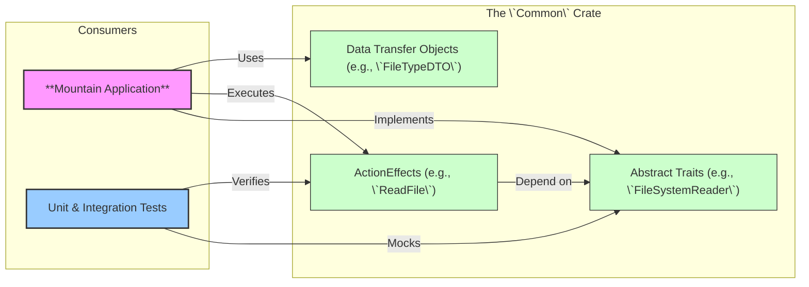

<table><tr>
<td colspan="1"> <h3 align="center"> <picture>
<source media="(prefers-color-scheme: dark)" srcset="https://PlayForm.Cloud/Dark/Image/GitHub/Land.svg">
<source media="(prefers-color-scheme: light)" srcset="https://PlayForm.Cloud/Image/GitHub/Land.svg">

</picture> </h3> </td> <td colspan="3" valign="top"> <h3 align="center"> Common 👨🏻‍🏭
</h3> </td>
</tr></table>


---

# **Common**&#x2001;👨🏻‍🏭

> **VS Code's codebase imports concrete implementations directly. Testing a single component means mocking entire subsystems. There is no dependency injection at the architecture level.**

_"Mock any service and test any element in isolation, no running editor required."_

[](https://github.com/CodeEditorLand/Common/tree/Current/LICENSE)
[](https://www.rust-lang.org/)&#x2001;[](https://www.rust-lang.org/)
[](https://www.rust-lang.org/)&#x2001;[](https://crates.io/crates/land-common)

Common defines pure abstract traits with zero concrete implementations. Every element builds on Common's typed effects and composable building blocks. The Rust compiler enforces contracts at build time. If an element changes its signature, every consumer fails to compile immediately. Tests run in milliseconds because you can mock any trait and test any element without launching a window, a WebView, or a sidecar.

📖 **[Rust API Documentation](https://Rust.Documentation.Editor.Land/Common/)**

---

## What It Does&#x2001;🔐

- **Pure abstract traits.** Zero concrete implementations. Every cross-element boundary is a typed contract.
- **Compile-time enforcement.** Change a trait signature and every consumer fails to compile immediately.
- **Millisecond tests.** Mock any trait and test any element without launching a window or WebView.
- **ActionEffect system.** Declarative effects that are composable, testable, and type-safe.

---

## In the Ecosystem&#x2001;👨🏻‍🏭 + 🏞️



---

## Project Structure&#x2001;🗺️

```
Common/
└── Source/
    ├── Library.rs                     # Crate root, declares all modules.
    ├── Environment/                   # The core DI system (Environment, Requires, HasEnvironment traits).
    ├── Effect/                        # The ActionEffect system (ActionEffect, ApplicationRunTime traits).
    ├── Error/                         # The universal CommonError enum.
    ├── DTO/                           # Shared Data Transfer Objects (re-exports from service modules).
    ├── Utility/                       # Utility functions (e.g., Serialization).
    ├── Command/                       # Command management service.
    ├── Configuration/                 # Configuration provider service.
    ├── CustomEditor/                  # Custom editor provider service.
    ├── Debug/                         # Debug service.
    ├── Diagnostic/                    # Diagnostic manager service.
    ├── Document/                      # Document provider service.
    ├── ExtensionManagement/           # Extension management service.
    ├── FileSystem/                    # FileSystem read/write service.
    │   └── DTO/                       # FileSystem-specific DTOs (FileTypeDTO, FileSystemStatDTO).
    ├── IPC/                           # Inter-process communication service.
    ├── Keybinding/                    # Keybinding provider service.
    ├── LanguageFeature/               # Language feature provider registry.
    │   └── DTO/                       # Language feature DTOs (CompletionListDTO, HoverResultDTO, etc.).
    ├── Output/                        # Output channel manager service.
    ├── Search/                        # Search provider service.
    ├── Secret/                        # Secret storage provider service.
    ├── SourceControlManagement/       # Source control management service.
    │   └── DTO/                       # SCM DTOs (SourceControlManagementProviderDTO, etc.).
    ├── StatusBar/                     # Status bar provider service.
    │   └── DTO/                       # StatusBar DTOs (StatusBarEntryDTO).
    ├── Storage/                       # Storage provider service.
    ├── Synchronization/               # Synchronization provider service.
    ├── Terminal/                      # Terminal provider service.
    ├── Testing/                       # Test controller service.
    ├── TreeView/                      # Tree view provider service.
    │   └── DTO/                       # TreeView DTOs (TreeItemDTO, TreeViewOptionsDTO).
    ├── UserInterface/                 # User interface provider service.
    │   └── DTO/                       # UI DTOs (MessageOptionsDTO, QuickPickOptionsDTO, etc.).
    ├── Webview/                       # Webview provider service.
    │   └── DTO/                       # Webview DTOs (WebviewContentOptionsDTO).
    └── Workspace/                     # Workspace provider service.
```

---

## Development&#x2001;🛠️

Common is a component of the Land workspace. Follow the
[Land Repository](https://github.com/CodeEditorLand/Land) instructions to
build and run.

---

## License&#x2001;⚖️

CC0 1.0 Universal. Public domain. No restrictions.
[LICENSE](https://github.com/CodeEditorLand/Common/tree/Current/LICENSE)

---

## See Also

- [Common Documentation](https://editor.land/Doc/common)
- [Architecture Overview](https://editor.land/Doc/architecture)
- [Why Rust](https://editor.land/Doc/why-rust)
- [Mountain](https://github.com/CodeEditorLand/Mountain)
- [Echo](https://github.com/CodeEditorLand/Echo)
- [Air](https://github.com/CodeEditorLand/Air)


## Funding & Acknowledgements 🙏🏻

**Common** is a core element of the **Land** ecosystem. This project is funded
through [NGI0 Commons Fund](https://NLnet.NL/commonsfund), a fund established by
[NLnet](https://NLnet.NL) with financial support from the European Commission's
[Next Generation Internet](https://ngi.eu) program. Learn more at the
[NLnet project page](https://NLnet.NL/project/Land).

The project is operated by PlayForm, based in Sofia, Bulgaria.

PlayForm acts as the open-source steward for Code Editor Land under the NGI0
Commons Fund grant.

<table>
	<thead>
		<tr>
			<th align="left"><strong>Land</strong></th>
			<th align="left"><strong>PlayForm</strong></th>
			<th align="left"><strong>NLnet</strong></th>
			<th align="left"><strong>NGI0 Commons Fund</strong></th>
		</tr>
	</thead>
	<tbody>
		<tr>
			<td align="left" valign="middle">
				<a href="https://Editor.Land">
					
				</a>
			</td>
			<td align="left" valign="middle">
				<a href="https://PlayForm.Cloud">
					
				</a>
			</td>
			<td align="left" valign="middle">
				<a href="https://NLnet.NL">
					
				</a>
			</td>
			<td align="left" valign="middle">
				<a href="https://NLnet.NL/commonsfund">
					
				</a>
			</td>
		</tr>
	</tbody>
</table>

---

**Project Maintainers**: Source Open
([Source/Open@Editor.Land](mailto:Source/Open@Editor.Land)) |
[GitHub Repository](https://github.com/CodeEditorLand/Common) |
[Report an Issue](https://github.com/CodeEditorLand/Common/issues) |
[Security Policy](https://github.com/CodeEditorLand/Common/security/policy)
