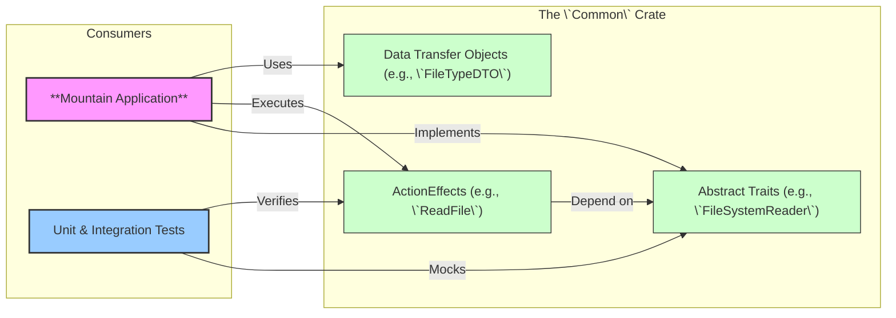

<table><tr>
<td colspan="1"> <h3 align="center"> <picture>
<source media="(prefers-color-scheme: dark)" srcset="https://PlayForm.Cloud/Dark/Image/GitHub/Land.svg">
<source media="(prefers-color-scheme: light)" srcset="https://PlayForm.Cloud/Image/GitHub/Land.svg">

</picture> </h3> </td> <td colspan="3" valign="top"> <h3 align="center"> Common 👨🏻‍🏭
</h3> </td>
</tr></table>

---

# **Common** 👨🏻‍🏭 The Architectural Core of Land

[](https://github.com/CodeEditorLand/Common/tree/Current/LICENSE)
[](https://www.rust-lang.org/)
[](https://crates.io/crates/land-common)

Welcome to **Common**! This crate is the architectural heart of the Land Code
Editor's native backend. It provides a pure, abstract foundation for building
application logic using a declarative, effects-based system. It contains **no
concrete implementations**; instead, it defines the "language" of the
application through a set of powerful, composable building blocks.

The entire `Mountain` backend and any future native components are built by
implementing the traits and consuming the effects defined in this crate.

**`Common`** is engineered to:

1.  **Enforce Architectural Boundaries:** By defining all application
    capabilities as abstract `trait`s, it ensures a clean separation between the
    definition of an operation and its execution.
2.  **Provide a Declarative Effect System:** Introduces the `ActionEffect` type,
    which describes an asynchronous operation as a value, allowing logic to be
    composed, tested, and executed in a controlled `ApplicationRunTime`.
3.  **Standardize Data Contracts:** Defines all Data Transfer Objects (DTOs) and
    a universal `CommonError` enum, ensuring consistent data structures and
    error handling across the entire native ecosystem.
4.  **Maximize Testability and Reusability:** Because this crate is pure and
    abstract, any component that depends on it can be tested with mock
    implementations of its traits, leading to fast and reliable unit tests.

---

## Key Features & Concepts 🔐

- **Declarative `ActionEffect` System:** A powerful pattern where operations are
  not executed immediately, but are instead described as `ActionEffect` data
  structures. These effects are then passed to a runtime for execution.
- **Trait-Based Dependency Injection:** A clean, compile-time DI system using
  the `Environment` and `Requires` traits, allowing components to declare their
  dependencies without being tied to a specific implementation.
- **Asynchronous Service Traits:** All core application services (e.g.,
  `FileSystemReader`, `UserInterfaceProvider`, `CommandExecutor`) are defined as
  `async trait`s, providing a fully asynchronous-first architecture.
- **Comprehensive DTO Library:** Contains definitions for all data structures
  used for IPC communication with `Cocoon` and internal state management in
  `Mountain`. All types are `serde`-compatible.
- **Universal `CommonError` Enum:** A single, exhaustive `enum` for all possible
  failures, enabling robust and predictable error handling across the entire
  application.

---

## Core Architecture Principles 🏗️

| Principle          | Description                                                                                                                                    | Key Components Involved                    |
| :----------------- | :--------------------------------------------------------------------------------------------------------------------------------------------- | :----------------------------------------- |
| **Abstraction**    | Define every application capability as an abstract `async trait`. Never include concrete implementation logic.                                 | All `*Provider.rs` and `*Manager.rs` files |
| **Declarativism**  | Represent every operation as an `ActionEffect` value. The crate provides constructor functions for these effects.                              | `Effect/*`, all effect constructor files   |
| **Composability**  | The `ActionEffect` system and trait-based DI are designed to be composed, allowing complex workflows to be built from simple, reusable pieces. | `Environment/*`, `Effect/*`                |
| **Contract-First** | Define all data structures (`DTO/*`) and error types (`Error/*`) first. These form the stable contract for all other components.               | `DTO/`, `Error/`                           |
| **Purity**         | This crate has minimal dependencies and is completely independent of Tauri, gRPC, or any specific application logic.                           | `Cargo.toml`                               |

---

## The `ActionEffect` System Explained

The core pattern in `Common` is the `ActionEffect`. Instead of writing a
function that immediately performs a side effect, you call a function that
_returns a description of that effect_.

**Traditional (Imperative) Approach:**

```rust
async fn read_my_file(fs: &impl FileSystem) -> Result<Vec<u8>, Error> {
// The side effect happens here.
    fs.read("/path/to/file").await
}
```

**The `Common` (Declarative) Approach:**

```rust
use Common::FileSystem;
use std::sync::Arc;

// 1. Create a description of the desired effect. No I/O happens here.
//    The effect's type signature explicitly declares its dependency: `Arc<dyn FileSystemReader>`.
let read_effect: ActionEffect<Arc<dyn FileSystemReader>, _, _> = FileSystem::ReadFile(PathBuf::from("/path/to/file"));

// 2. Later, in a separate part of the system (the runtime), execute it.
//    The runtime will see that the effect needs a FileSystemReader, provide one from its
//    environment, and run the operation.
let file_content = runtime.Run(read_effect).await?;
```

This separation is what makes the architecture so flexible and testable.

---

## Project Structure Overview 🗺️

The `Common` crate is organized by service domain, with each domain containing
its trait definitions, DTOs, and effect constructors.

```
Common/
└── Source/
    ├── Library.rs                      # Crate root, declares all modules.
    ├── Environment/                    # The core DI system (Environment, Requires traits).
    ├── Effect/                         # The ActionEffect system (ActionEffect, ApplicationRunTime traits).
    ├── Error/                          # The universal CommonError enum.
    ├── DTO/                            # Shared Data Transfer Objects.
    └── Command/                        # Example service domain:
        ├── mod.rs                      # Module aggregator.
        ├── CommandExecutor.rs          # The abstract `trait` definition.
        ├── DTO/                        # (if any service-specific DTOs are needed)
        └── ExecuteCommand.rs           # The `ActionEffect` constructor function.
    └── (Other service domains like FileSystem/, UserInterface/, etc. follow the same pattern)
```

---

## Deep Dive & Architectural Patterns 🔬

To understand the core philosophy behind this crate and how its components work
together, please refer to the detailed technical breakdown in
[`docs/Deep Dive.md`](docs/Deep%20Dive.md). This document explains the
`ActionEffect` system, the trait-based dependency injection model, and provides
a guide for adding new services to the architecture.

---

## How `Common` Fits into the `Land` Ecosystem 👨🏻‍🏭 + 🏞️

`Common` is the foundational layer upon which the entire native backend is
built. It has no knowledge of its consumers, but they are entirely dependent on
it.



---

## Getting Started 🚀

### Installation

`Common` is intended to be used as a local path dependency within the `Land`
workspace. In `Mountain`'s `Cargo.toml`:

```toml
[dependencies]
Common = { path = "../Common" }
```

### Usage

A developer working within the `Mountain` codebase would use `Common` as
follows:

1.  **Implement a Trait:** In `Mountain/Source/Environment/`, provide the
    concrete implementation for a `Common` trait.

```rust
// In Mountain/Source/Environment/FileSystemProvider.rs

use Common::FileSystem::{FileSystemReader, FileSystemWriter};

#[async_trait]
impl FileSystemReader for MountainEnvironment {
	async fn ReadFile(&self, Path: &PathBuf) -> Result<Vec<u8>, CommonError> {
		// ... actual `tokio::fs` call ...
	}

	// ...
}
```

2.  **Create and Execute an Effect:** In business logic, create and run an
    effect.

```rust
// In a Mountain service or command

use Common::FileSystem;
use Common::Effect::ApplicationRunTime;

async fn some_logic(runtime: Arc<impl ApplicationRunTime>) {
	let path = PathBuf::from("/my/file.txt");
	let read_effect = FileSystem::ReadFile(path);

	match runtime.Run(read_effect).await {
		Ok(content) => info!("File content length: {}", content.len()),
		Err(e) => error!("Failed to read file: {:?}", e),
	}
}
```

---

## License ⚖️

This project is released into the public domain under the **Creative Commons CC0
Universal** license. You are free to use, modify, distribute, and build upon
this work for any purpose, without any restrictions. For the full legal text,
see the [`LICENSE`](LICENSE) file.

---

## Changelog 📜

Stay updated with our progress! See [`CHANGELOG.md`](CHANGELOG.md) for a history
of changes specific to **Common**.

---

## Funding & Acknowledgements 🙏🏻

**Common** is a core element of the **Land** ecosystem. This project is funded
through [NGI0 Commons Fund](https://NLnet.NL/commonsfund), a fund established by
[NLnet](https://NLnet.NL) with financial support from the European Commission's
[Next Generation Internet](https://ngi.eu) program. Learn more at the
[NLnet project page](https://NLnet.NL/project/Land).

<table border="0" cellpadding="10" cellspacing="0" width="100%">
	<thead>
		<tr>
			<th align="left"><strong>Land</strong></th>
			<th align="left"><strong>PlayForm</strong></th>
			<th align="left"><strong>NLnet</strong></th>
			<th align="left"><strong>NGI0 Commons Fund</strong></th>
		</tr>
	</thead>
	<tbody>
		<tr>
			<td align="left" valign="middle">
				<a href="https://Editor.Land">
					
				</a>
			</td>
			<td align="left" valign="middle">
				<a href="https://PlayForm.Cloud">
					
				</a>
			</td>
			<td align="left" valign="middle">
				<a href="https://NLnet.NL">
					
				</a>
			</td>
			<td align="left" valign="middle">
				<a href="https://NLnet.NL/commonsfund">
					
				</a>
			</td>
		</tr>
	</tbody>
</table>

---

**Project Maintainers**: Source Open
([Source/Open@Editor.Land](mailto:Source/Open@Editor.Land)) |
[GitHub Repository](https://github.com/CodeEditorLand/Common) |
[Report an Issue](https://github.com/CodeEditorLand/Common/issues) |
[Security Policy](https://github.com/CodeEditorLand/Common/security/policy)
