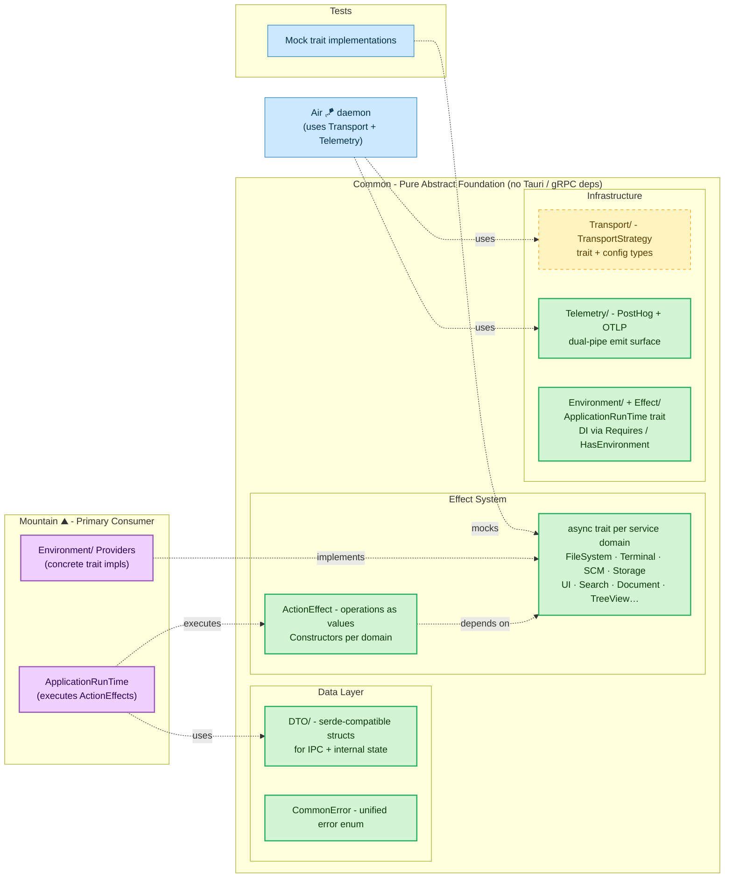

# **Common** 🧩

The Architectural Core of Land

> **VS Code's codebase imports concrete implementations directly. Testing a single component means mocking entire subsystems. There is no dependency injection at the architecture level.**

_"Mock any service and test any element in isolation, no running editor required."_

[](https://github.com/CodeEditorLand/Common/tree/Current/LICENSE) [](https://www.rust-lang.org/) [](https://www.rust-lang.org/) [](https://www.rust-lang.org/) [](https://crates.io/crates/land-common)

[Rust API Documentation](https://Rust.Documentation.editor.land/Common/)

Welcome to **Common**! This crate is the architectural heart of the Land Code Editor's native backend. It provides a pure, abstract foundation for building application logic using a declarative, effects-based system. It contains **no concrete implementations**; instead, it defines the "language" of the application through a set of powerful, composable building blocks.

The entire `Mountain` backend and any future native components are built by implementing the traits and consuming the effects defined in this crate.

**`Common`** is engineered to:

1. **Enforce Architectural Boundaries:** By defining all application capabilities as abstract `trait`s, it ensures a clean separation between the definition of an operation and its execution.
2. **Provide a Declarative Effect System:** Introduces the `ActionEffect` type, which describes an asynchronous operation as a value, allowing logic to be composed, tested, and executed in a controlled `ApplicationRunTime`.
3. **Standardize Data Contracts:** Defines all Data Transfer Objects (DTOs) and a universal `CommonError` enum, ensuring consistent data structures and error handling across the entire native ecosystem.
4. **Maximize Testability and Reusability:** Because this crate is pure and abstract, any component that depends on it can be tested with mock implementations of its traits, leading to fast and reliable unit tests.

---

## Overview

**Common** 🧩 is the architectural core of the Land Code Editor's native backend. It provides a pure, abstract foundation with **no concrete implementations** — defining the application's "language" through `async trait`s per service domain, an `ActionEffect` declarative system, Data Transfer Objects (DTOs) for IPC, a unified `CommonError` enum, a transport-agnostic communication layer, and a telemetry dual-pipe. By defining capabilities as abstract traits, it enforces clean architectural boundaries, maximizes testability through mock implementations, and ensures consistent data contracts across the entire native ecosystem.

### Key Features & Concepts

The `ActionEffect` system treats operations as data structures rather than direct function calls. Effects are constructed as values that describe the desired side effect and are then passed to an `ApplicationRunTime` for execution. This declarative approach enables composition, testing, and controlled execution in a single unified pattern.

Dependency injection is handled at compile time through the `Environment` and `Requires` traits. Components declare their service needs without coupling to specific implementations. All core application services are defined as `async trait`s, enforcing an asynchronous-first architecture across the entire system.

The DTO library provides all data structures used for IPC communication with `Cocoon` and internal state management in `Mountain`. Every type is `serde`-compatible. A single `CommonError` enum covers all possible failures across every service domain, making error handling consistent and predictable.

The `Transport` layer offers transport-agnostic communication through a unified `TransportStrategy` trait. Concrete implementations (`gRPCTransport`, `IPCTransport`, `WASMTransport`, `MistTransport`) live in `Grove`. The `Telemetry` module provides a dual-pipe (`PostHog` + `OTLP`) emit surface shared across all `Rust` sidecars.

---

## Architecture



---

## Key Components

| Component | Path | Description |
| --------- | ---- | ----------- |
| Library Root | `Source/Library.rs` | Crate root, declares all modules. |
| Environment | `Source/Environment/` | The core DI system (Environment, Requires, HasEnvironment traits). |
| Effect | `Source/Effect/` | The ActionEffect system (ActionEffect, ApplicationRunTime traits). |
| Error | `Source/Error/` | The universal CommonError enum. |
| DTO | `Source/DTO/` | Shared Data Transfer Objects (re-exports from service modules). |
| Utility | `Source/Utility/` | Utility functions (e.g., Serialization). |
| Command | `Source/Command/` | Command management service. |
| Configuration | `Source/Configuration/` | Configuration provider service. |
| CustomEditor | `Source/CustomEditor/` | Custom editor provider service. |
| Debug | `Source/Debug/` | Debug service. |
| Diagnostic | `Source/Diagnostic/` | Diagnostic manager service. |
| Document | `Source/Document/` | Document provider service. |
| ExtensionManagement | `Source/ExtensionManagement/` | Extension management service. |
| FileSystem | `Source/FileSystem/` | File system read/write service. |
| IPC | `Source/IPC/` | Inter-process communication service. |
| Keybinding | `Source/Keybinding/` | Keybinding provider service. |
| LanguageFeature | `Source/LanguageFeature/` | Language feature provider registry. |
| Output | `Source/Output/` | Output channel manager service. |
| Search | `Source/Search/` | Search provider service. |
| Secret | `Source/Secret/` | Secret storage provider service. |
| SourceControlManagement | `Source/SourceControlManagement/` | Source control management service. |
| StatusBar | `Source/StatusBar/` | Status bar provider service. |
| Storage | `Source/Storage/` | Storage provider service. |
| Synchronization | `Source/Synchronization/` | Synchronization provider service. |
| Telemetry | `Source/Telemetry/` | Telemetry service (dual-pipe PostHog + OTLP). |
| Terminal | `Source/Terminal/` | Terminal provider service. |
| Testing | `Source/Testing/` | Test controller service. |
| Transport | `Source/Transport/` | Transport-agnostic communication layer. |
| TreeView | `Source/TreeView/` | Tree view provider service. |
| UserInterface | `Source/UserInterface/` | User interface provider service. |
| Webview | `Source/Webview/` | Webview provider service. |
| Workspace | `Source/Workspace/` | Workspace provider service. |

---

## Core Architecture Principles

| Principle | Description | Key Components Involved |
| :----------------- | :--------------------------------------------------------------------------------------------------------------------------------------------- | :----------------------------------------- |
| **Abstraction** | Define every application capability as an abstract `async trait`. Never include concrete implementation logic. | All `*Provider.rs` and `*Manager.rs` files |
| **Declarativism** | Represent every operation as an `ActionEffect` value. The crate provides constructor functions for these effects. | `Effect/*`, all effect constructor files |
| **Composability** | The `ActionEffect` system and trait-based DI are designed to be composed, allowing complex workflows to be built from simple, reusable pieces. | `Environment/*`, `Effect/*` |
| **Contract-First** | Define all data structures (`DTO/*`) and error types (`Error/*`) first. These form the stable contract for all other components. | `DTO/`, `Error/` |
| **Purity** | This crate has minimal dependencies and is completely independent of Tauri, gRPC, or any specific application logic. | `Cargo.toml` |

---

## The `ActionEffect` System Explained

The core pattern in `Common` is the `ActionEffect`. Instead of writing a function that immediately performs a side effect, you call a function that _returns a description of that effect_.

**Traditional (Imperative) Approach:**

```rust
async fn read_my_file(fs: &impl FileSystem) -> Result<Vec<u8>, Error> {
    // The side effect happens here.
    fs.read("/path/to/file").await
}
```

**The `Common` (Declarative) Approach:**

```rust
use CommonLibrary::FileSystem;
use std::sync::Arc;

// 1. Create a description of the desired effect. No I/O happens here.
//    The effect's type signature explicitly declares its dependency: Arc<dyn FileSystemReader>.
let ReadEffect: ActionEffect<Arc<dyn FileSystemReader>, _, _> =
    FileSystem::ReadFile(PathBuf::from("/path/to/file"));

// 2. Later, in a separate part of the system (the runtime), execute it.
//    The runtime will see that the effect needs a FileSystemReader, provide one from its
//    environment, and run the operation.
let FileContent = Runtime.Run(ReadEffect).await?;
```

This separation makes the architecture flexible and testable — swap any trait implementation without changing the logic that uses it.

---

## In the Land Project

`Common` is the foundational layer upon which the entire native backend is built. It has no knowledge of its consumers, but they are entirely dependent on it.

- **Mountain** 🏔️ — Primary consumer: implements traits with concrete `Environment/` providers, executes `ActionEffect`s via `ApplicationRunTime`
- **Air** 🪁 — Background daemon: uses `Transport` and `Telemetry` modules
- **Tests** — Mock trait implementations for unit testing

---

## Getting Started

### Installation

`Common` is intended to be used as a local path dependency within the `Land` workspace. In `Mountain`'s `Cargo.toml`:

```toml
[dependencies]
Common = { path = "../Common" }
```

### Usage

1. **Implement a Trait:** In `Mountain/Source/Environment/`, provide the concrete implementation for a `Common` trait.

```rust
// In Mountain/Source/Environment/FileSystemProvider.rs

use CommonLibrary::FileSystem::{FileSystemReader, FileSystemWriter};

#[async_trait]
impl FileSystemReader for MountainEnvironment {
    async fn ReadFile(&self, Path: &PathBuf) -> Result<Vec<u8>, CommonError> {
        // ... actual tokio::fs call ...
    }
    // ...
}
```

2. **Create and Execute an Effect:** In business logic, create and run an effect.

```rust
// In a Mountain service or command

use CommonLibrary::FileSystem;
use CommonLibrary::Effect::ApplicationRunTime;

async fn SomeLogic(Runtime: Arc<impl ApplicationRunTime>) {
    let Path = PathBuf::from("/my/file.txt");
    let ReadEffect = FileSystem::ReadFile(Path);

    match Runtime.Run(ReadEffect).await {
        Ok(Content) => info!("File content length: {}", Content.len()),
        Err(Error) => error!("Failed to read file: {:?}", Error),
    }
}
```

---

## API Reference

- [Rust API Documentation](https://Rust.Documentation.editor.land/Common/)
- [Architecture Overview](https://Editor.Land/Doc/architecture)
- [Deep Dive](Documentation/GitHub/DeepDive.md) — The `ActionEffect` system, trait-based DI model, and guide for adding new services

---

## Related Documentation

- [Architecture Overview](https://Editor.Land/Doc/architecture) — Internal module structure
- [Deep Dive](Documentation/GitHub/DeepDive.md) — In-depth technical details
- [Land Documentation](../../Documentation/GitHub/README.md) — Complete documentation index
- [`Mountain`](https://github.com/CodeEditorLand/Mountain) — Primary consumer implementing Common traits
- [`Echo`](https://github.com/CodeEditorLand/Echo) — Work-stealing scheduler
- [`Air`](https://github.com/CodeEditorLand/Air) — Background daemon
- [Why Rust](https://Editor.Land/Doc/why-rust)
- [`CHANGELOG.md`](https://github.com/CodeEditorLand/Common/tree/Current/CHANGELOG.md) — History of changes specific to Common

---

## Funding

This project is funded through [NGI0 Commons Fund](https://NLnet.NL/commonsfund), a fund established by [NLnet](https://NLnet.NL) with financial support from the European Commission's Next Generation Internet program, under grant agreement No 101135429.

**Common** is a core element of the **Land** ecosystem. This project is funded through [NGI0 Commons Fund](https://NLnet.NL/commonsfund), a fund established by [NLnet](https://NLnet.NL) with financial support from the European Commission's [Next Generation Internet](https://ngi.eu) program. Learn more at the [NLnet project page](https://NLnet.NL/project/Land).

The project is operated by PlayForm, based in Sofia, Bulgaria. PlayForm acts as the open-source steward for Code Editor Land under the NGI0 Commons Fund grant.

| | |
| --- | --- |
| [](https://Editor.Land) | [](https://PlayForm.Cloud) |
| [](https://NLnet.NL) | [](https://NLnet.NL/commonsfund) |
