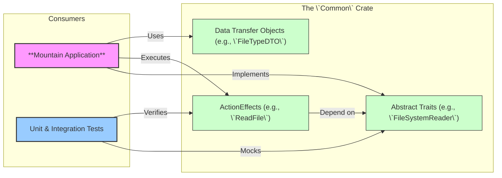

<table><tr>
<td colspan="1"> <h3 align="center"> <picture>
<source media="(prefers-color-scheme: dark)" srcset="https://PlayForm.Cloud/Dark/Image/GitHub/Land.svg">
<source media="(prefers-color-scheme: light)" srcset="https://PlayForm.Cloud/Image/GitHub/Land.svg">

</picture> </h3> </td> <td colspan="3" valign="top"> <h3 align="center"> Common 👨🏻‍🏭
</h3> </td>
</tr></table>

---

# **Common** 👨🏻‍🏭

The Architectural Core of Land

[](https://github.com/CodeEditorLand/Common/tree/Current/LICENSE)
[](https://www.rust-lang.org/)
[](https://crates.io/crates/land-common)

Welcome to **Common**! This crate is the architectural heart of the Land Code
Editor's native backend. It provides a pure, abstract foundation for building
application logic using a declarative, effects-based system. It contains **no
concrete implementations**; instead, it defines the "language" of the
application through a set of powerful, composable building blocks.

The entire `Mountain` backend and any future native components are built by
implementing the traits and consuming the effects defined in this crate.

**What Common gives you:**

1. **Test without Tauri.** Every capability is an abstract trait. Mock the trait,
   test your logic. No window, no webview, no sidecar needed.
2. **Bugs at compile time.** The `ActionEffect` type describes operations as
   values. The compiler catches missing dependencies and type mismatches before
   runtime.
3. **One error enum, everywhere.** `CommonError` covers every failure domain.
   No stringly-typed errors, no `unwrap()` surprises.
4. **Stable IPC contracts.** DTOs are `serde`-compatible and shared across
   Mountain, Cocoon, and Wind. Change the type, and every consumer gets a
   compile error.

📖 **[Rust API Documentation](https://Rust.Documentation.Editor.Land/Common/)**

---

## Key Features & Concepts 🔐

- **Declarative effects, not callbacks.** Operations are data. Describe what
  you want, compose effects, then run them. Testing is trivial: just inspect
  the effect value without executing it.
- **Compile-time dependency injection.** The `Environment` and `Requires` traits
  wire dependencies at compile time. No runtime reflection, no service locator.
- **Async-first.** Every service trait (`FileSystemReader`, `CommandExecutor`,
  etc.) is `async`. No blocking calls anywhere in the contract.
- **Shared DTOs for all IPC.** Mountain, Cocoon, and Wind all use the same
  `serde`-compatible types. Schema changes break at compile time, not at runtime.
- **One error type.** `CommonError` covers all 20 service domains. Pattern match
  once, handle every case.

---

## Core Architecture Principles 🏗️

| Principle          | Description                                                                                                                                    | Key Components Involved                    |
| :----------------- | :--------------------------------------------------------------------------------------------------------------------------------------------- | :----------------------------------------- |
| **Abstraction**    | Define every application capability as an abstract `async trait`. Never include concrete implementation logic.                                 | All `*Provider.rs` and `*Manager.rs` files |
| **Declarativism**  | Represent every operation as an `ActionEffect` value. The crate provides constructor functions for these effects.                              | `Effect/*`, all effect constructor files   |
| **Composability**  | The `ActionEffect` system and trait-based DI are designed to be composed, allowing complex workflows to be built from simple, reusable pieces. | `Environment/*`, `Effect/*`                |
| **Contract-First** | Define all data structures (`DTO/*`) and error types (`Error/*`) first. These form the stable contract for all other components.               | `DTO/`, `Error/`                           |
| **Purity**         | This crate has minimal dependencies and is completely independent of Tauri, gRPC, or any specific application logic.                           | `Cargo.toml`                               |

---

## The `ActionEffect` System Explained

The core pattern in `Common` is the `ActionEffect`. Instead of writing a
function that immediately performs a side effect, you call a function that
_returns a description of that effect_.

**Traditional (Imperative) Approach:**

```rust
async fn read_my_file(fs: &impl FileSystem) -> Result<Vec<u8>, Error> {
// The side effect happens here.
    fs.read("/path/to/file").await
}
```

**The `Common` (Declarative) Approach:**

```rust
use CommonLibrary::FileSystem;
use std::sync::Arc;

// 1. Create a description of the desired effect. No I/O happens here.
//    The effect's type signature explicitly declares its dependency: `Arc<dyn FileSystemReader>`.
let read_effect: ActionEffect<Arc<dyn FileSystemReader>, _, _> = FileSystem::ReadFile(PathBuf::from("/path/to/file"));

// 2. Later, in a separate part of the system (the runtime), execute it.
//    The runtime will see that the effect needs a FileSystemReader, provide one from its
//    environment, and run the operation.
let file_content = runtime.Run(read_effect).await?;
```

This separation makes the architecture flexible and testable.

---

## Project Structure Overview 🗺️

The `Common` crate is organized by service domain, with each domain containing
its trait definitions, DTOs, and effect constructors.

```
Common/
└── Source/
    ├── Library.rs                     # Crate root, declares all modules.
    ├── Environment/                   # The core DI system (Environment, Requires, HasEnvironment traits).
    ├── Effect/                        # The ActionEffect system (ActionEffect, ApplicationRunTime traits).
    ├── Error/                         # The universal CommonError enum.
    ├── DTO/                           # Shared Data Transfer Objects (re-exports from service modules).
    ├── Utility/                       # Utility functions (e.g., Serialization).
    ├── Command/                       # Command management service.
    ├── Configuration/                 # Configuration provider service.
    ├── CustomEditor/                  # Custom editor provider service.
    ├── Debug/                         # Debug service.
    ├── Diagnostic/                    # Diagnostic manager service.
    ├── Document/                      # Document provider service.
    ├── ExtensionManagement/           # Extension management service.
    ├── FileSystem/                    # FileSystem read/write service.
    │   └── DTO/                       # FileSystem-specific DTOs (FileTypeDTO, FileSystemStatDTO).
    ├── IPC/                           # Inter-process communication service.
    ├── Keybinding/                    # Keybinding provider service.
    ├── LanguageFeature/               # Language feature provider registry.
    │   └── DTO/                       # Language feature DTOs (CompletionListDTO, HoverResultDTO, etc.).
    ├── Output/                        # Output channel manager service.
    ├── Search/                        # Search provider service.
    ├── Secret/                        # Secret storage provider service.
    ├── SourceControlManagement/       # Source control management service.
    │   └── DTO/                       # SCM DTOs (SourceControlManagementProviderDTO, etc.).
    ├── StatusBar/                     # Status bar provider service.
    │   └── DTO/                       # StatusBar DTOs (StatusBarEntryDTO).
    ├── Storage/                       # Storage provider service.
    ├── Synchronization/               # Synchronization provider service.
    ├── Terminal/                      # Terminal provider service.
    ├── Testing/                       # Test controller service.
    ├── TreeView/                      # Tree view provider service.
    │   └── DTO/                       # TreeView DTOs (TreeItemDTO, TreeViewOptionsDTO).
    ├── UserInterface/                 # User interface provider service.
    │   └── DTO/                       # UI DTOs (MessageOptionsDTO, QuickPickOptionsDTO, etc.).
    ├── Webview/                       # Webview provider service.
    │   └── DTO/                       # Webview DTOs (WebviewContentOptionsDTO).
    └── Workspace/                     # Workspace provider service.
```

---

## Deep Dive & Architectural Patterns 🔬

To understand the core philosophy behind this crate and how its components work
together, please refer to the detailed technical breakdown in
[`Documentation/GitHub/DeepDive.md`](https://github.com/CodeEditorLand/Common/tree/Current/Documentation/GitHub/DeepDive.md).

This document explains the `ActionEffect` system, the trait-based dependency
injection model, and provides a guide for adding new services to the
architecture.

---

## How `Common` Fits into the `Land` Ecosystem 👨🏻‍🏭 + 🏞️

`Common` is the foundational layer upon which the entire native backend is
built. It has no knowledge of its consumers, but they are entirely dependent on
it.



---

## Getting Started 🚀

### Installation 📥

`Common` is intended to be used as a local path dependency within the `Land`
workspace. In `Mountain`'s `Cargo.toml`:

```toml
[dependencies]
Common = { path = "../Common" }
```

### Usage 🚀

A developer working within the `Mountain` codebase would use `Common` as
follows:

1. **Implement a Trait:** In `Mountain/Source/Environment/`, provide the
   concrete implementation for a `Common` trait.

```rust
// In Mountain/Source/Environment/FileSystemProvider.rs

use CommonLibrary::FileSystem::{FileSystemReader, FileSystemWriter};

#[async_trait]
impl FileSystemReader for MountainEnvironment {
	async fn ReadFile(&self, Path: &PathBuf) -> Result<Vec<u8>, CommonError> {
		// ... actual `tokio::fs` call ...
	}

	// ...
}
```

2. **Create and Execute an Effect:** In business logic, create and run an
   effect.

```rust
// In a Mountain service or command

use CommonLibrary::FileSystem;
use CommonLibrary::Effect::ApplicationRunTime;

async fn some_logic(runtime: Arc<impl ApplicationRunTime>) {
	let path = PathBuf::from("/my/file.txt");
	let read_effect = FileSystem::ReadFile(path);

	match runtime.Run(read_effect).await {
		Ok(content) => info!("File content length: {}", content.len()),
		Err(e) => error!("Failed to read file: {:?}", e),
	}
}
```

---

## License ⚖️

This project is released into the public domain under the **Creative Commons CC0
Universal** license.

You are free to use, modify, distribute, and build upon this work for any
purpose, without any restrictions. For the full legal text, see the
[`LICENSE`](https://github.com/CodeEditorLand/Common/tree/Current/) file.

---

## Changelog 📜

Stay updated with our progress! See
[`CHANGELOG.md`](https://github.com/CodeEditorLand/Common/tree/Current/) for a
history of changes specific to **Common**.

---


## See Also

- [Architecture Overview](https://editor.land/Doc/architecture)
- [Mountain](https://github.com/CodeEditorLand/Mountain)
- [Echo](https://github.com/CodeEditorLand/Echo)
- [Air](https://github.com/CodeEditorLand/Air)

## Funding & Acknowledgements 🙏🏻

**Common** is a core element of the **Land** ecosystem. This project is funded
through [NGI0 Commons Fund](https://NLnet.NL/commonsfund), a fund established by
[NLnet](https://NLnet.NL) with financial support from the European Commission's
[Next Generation Internet](https://ngi.eu) program. Learn more at the
[NLnet project page](https://NLnet.NL/project/Land).

The project is operated by PlayForm, based in Sofia, Bulgaria.

PlayForm acts as the open-source steward for Code Editor Land under the NGI0
Commons Fund grant.

<table>
	<thead>
		<tr>
			<th align="left"><strong>Land</strong></th>
			<th align="left"><strong>PlayForm</strong></th>
			<th align="left"><strong>NLnet</strong></th>
			<th align="left"><strong>NGI0 Commons Fund</strong></th>
		</tr>
	</thead>
	<tbody>
		<tr>
			<td align="left" valign="middle">
				<a href="https://Editor.Land">
					
				</a>
			</td>
			<td align="left" valign="middle">
				<a href="https://PlayForm.Cloud">
					
				</a>
			</td>
			<td align="left" valign="middle">
				<a href="https://NLnet.NL">
					
				</a>
			</td>
			<td align="left" valign="middle">
				<a href="https://NLnet.NL/commonsfund">
					
				</a>
			</td>
		</tr>
	</tbody>
</table>

---

**Project Maintainers**: Source Open
([Source/Open@Editor.Land](mailto:Source/Open@Editor.Land)) |
[GitHub Repository](https://github.com/CodeEditorLand/Common) |
[Report an Issue](https://github.com/CodeEditorLand/Common/issues) |
[Security Policy](https://github.com/CodeEditorLand/Common/security/policy)
