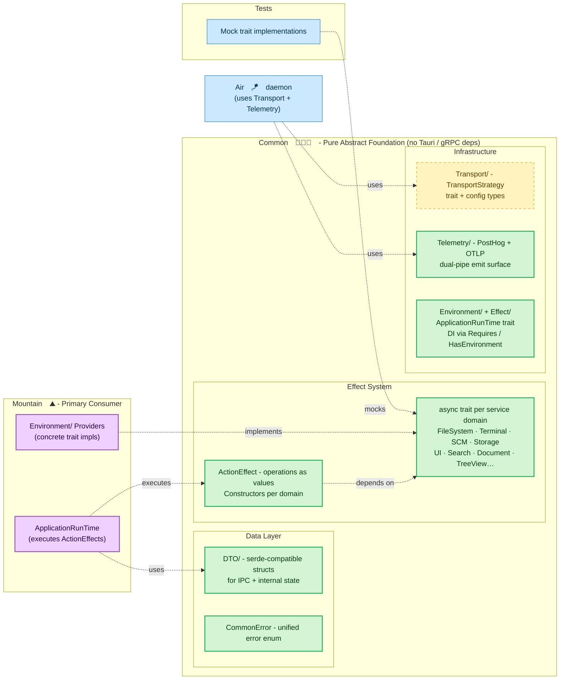

# **Common**&#x2001;🧑🏻‍🏭

<table>
	<tr>
		<td>
			<a href="https://GitHub.Com/CodeEditorLand/Common" target="_blank">
				<picture>
					<source media="(prefers-color-scheme: dark)" srcset="https://img.shields.io/github/last-commit/CodeEditorLand/Common?label=Update&color=black&labelColor=black&logoColor=white&logoWidth=0" />
					<source media="(prefers-color-scheme: light)" srcset="https://img.shields.io/github/last-commit/CodeEditorLand/Common?label=Update&color=white&labelColor=white&logoColor=black&logoWidth=0" />
					
				</picture>
			</a>
			<br />
			<a href="https://GitHub.Com/CodeEditorLand/Common" target="_blank">
				<picture>
					<source media="(prefers-color-scheme: dark)" srcset="https://img.shields.io/github/issues/CodeEditorLand/Common?label=Issue&color=black&labelColor=black&logoColor=white&logoWidth=0" />
					<source media="(prefers-color-scheme: light)" srcset="https://img.shields.io/github/issues/CodeEditorLand/Common?label=Issue&color=white&labelColor=white&logoColor=black&logoWidth=0" />
					
				</picture>
			</a>
		</td>
		<td>
			<a href="https://github.com/CodeEditorLand/Common" target="_blank">
				<picture>
					<source media="(prefers-color-scheme: dark)" srcset="https://img.shields.io/github/stars/CodeEditorLand/Common?style=flat&label=Star&logo=github&color=black&labelColor=black&logoColor=white&logoWidth=0" />
					<source media="(prefers-color-scheme: light)" srcset="https://img.shields.io/github/stars/CodeEditorLand/Common?style=flat&label=Star&logo=github&color=white&labelColor=white&logoColor=black&logoWidth=0" />
					
				</picture>
			</a>
			<br />
			<a href="https://GitHub.Com/CodeEditorLand/Common" target="_blank">
				<picture>
					<source media="(prefers-color-scheme: dark)" srcset="https://img.shields.io/github/downloads/CodeEditorLand/Common/total?label=Download&color=black&labelColor=black&logoColor=white&logoWidth=0" />
					<source media="(prefers-color-scheme: light)" srcset="https://img.shields.io/github/downloads/CodeEditorLand/Common/total?label=Download&color=white&labelColor=white&logoColor=black&logoWidth=0" />
					
				</picture>
			</a>
		</td>
	</tr>
</table>

The Pure Abstract Foundation for Land&#x2001;🏞️

> **VS Code's codebase imports concrete implementations directly. Testing a
> single component means mocking entire subsystems. There is no dependency
> injection at the architecture level.**

_"Mock any service and test any element in isolation, no running editor
required."_

[](https://github.com/CodeEditorLand/Common/tree/Current/LICENSE)
[](https://www.rust-lang.org/) [](https://crates.io/crates/land-common)
[](https://www.rust-lang.org/) [](https://www.rust-lang.org/)

**[Rust API Documentation](https://rust.documentation.common.editor.land/)**&#x2001;📖

---

## Overview

**Common** is the architectural core of the Land Code Editor's native backend.
It contains no working code - only abstract definitions. Think of it as the
shared vocabulary that every other native component speaks.

It defines several things that the rest of the system depends on:

- **Service traits** - Abstract descriptions of what every editor service should
  be able to do (read files, open terminals, search code, show UI dialogs). Each
  trait says _what_ needs to happen, never _how_.
- **ActionEffect system** - Instead of calling functions that immediately do
  work, components construct descriptions of the work they want done (an
  "effect") and hand it to a runtime. This means effects can be inspected,
  tested, composed, and controlled before execution.
- **Data Transfer Objects (DTOs)** - The data structures that flow between
  components. All types work with `serde` so they serialize cleanly for IPC
  between `Mountain`&#x2001;⛰️, `Cocoon`&#x2001;🦋, `Grove`&#x2001;🌳, and all
  sidecars.
- **CommonError** - One error type for every possible failure across every
  service. File system errors, terminal errors, language feature errors - all
  reported the same way.
- **Transport layer** - A `TransportStrategy` trait that defines how components
  talk to each other, without committing to any specific protocol. Concrete
  transports (`gRPC`, `IPC`, `WASM`, `Mist`) are implemented in
  `Grove`&#x2001;🌳.
- **Telemetry** - A shared pipeline for sending events to `PostHog` and traces
  to any `OTLP`-compatible backend.

Everything in `Mountain`&#x2001;⛰️ - and any future native component - is built
by implementing these traits and consuming these effects. The crate itself knows
nothing about `Tauri`, `gRPC`, or application startup. That separation is what
lets you test any component in isolation by providing mock implementations of
the traits it needs.

**Common is engineered to:**

1. **Define Pure Abstractions** - Every application capability is expressed as
   an `async trait` with zero concrete implementation logic.
2. **Enable Compile-Time DI** - The `Environment` and `Requires` traits let
   components declare what services they need without hard-coding where those
   services come from.
3. **Stabilize Data Contracts** - All DTOs and error types form the stable IPC
   contract between `Mountain`&#x2001;⛰️, `Cocoon`&#x2001;🦋, `Grove`&#x2001;🌳,
   and all sidecars.
4. **Provide Transport-Agnostic Communication** - The `TransportStrategy` trait
   abstracts the wire protocol so the same handler code works over `gRPC`,
   `IPC`, `WASM`, or `Mist` without changes.

---

## Key Features&#x2001;⚙️

**Declarative `ActionEffect` System** - Instead of calling functions that
immediately perform work, components construct an `ActionEffect` - a value that
_describes_ what should happen - and hand it to the `ApplicationRunTime` for
execution. This makes operations inspectable, composable, and testable before
they ever touch the filesystem or network. For example, instead of writing a
function that opens a file, you call a function that _returns a description_ of
opening that file. The runtime decides when and how to execute it.

**Compile-Time Dependency Injection** - The `Environment` and `Requires` traits
let components declare what services they need without hard-coding where those
services come from. A component that needs a file system just says "I require a
`FileSystemReader`" - it doesn't care whether that's a real disk, a mock for
testing, or a virtual filesystem. All core services are defined as
`async trait`s, keeping the entire system asynchronous-first.

**DTO Library for IPC** - Every data structure used for IPC communication with
`Cocoon`&#x2001;🦋 and internal state management in `Mountain`&#x2001;⛰️ is
defined here. All types are `serde`-compatible, forming the stable contract
between all Land components.

**Unified Error Handling** - A single `CommonError` enum covers every possible
failure across all service domains - `FileSystem`, `Terminal`, `SCM`,
`LanguageFeature`, `Transport`, and more. Error handling is consistent and
predictable everywhere.

**Transport-Agnostic Communication** - The `Transport/` layer defines a
`TransportStrategy` trait. Concrete implementations (`gRPCTransport`,
`IPCTransport`, `WASMTransport`, `MistTransport`) live in `Grove`&#x2001;🌳.

**Dual-Pipe Telemetry** - The `Telemetry/` module provides a shared `PostHog` +
`OTLP` emit surface consumed by all `Rust` sidecars.

**Minimal Dependencies** - This crate depends only on `serde`, `tokio`,
`async-trait`, and a handful of foundational crates. It has zero knowledge of
`Tauri`, `gRPC`, or any specific application logic.

---

## Core Architecture Principles&#x2001;🏗️

| Principle          | Description                                                                                                                                    | Key Components                             |
| ------------------ | ---------------------------------------------------------------------------------------------------------------------------------------------- | ------------------------------------------ |
| **Abstraction**    | Define every application capability as an abstract `async trait`. Never include concrete implementation logic.                                 | All `*Provider.rs` and `*Manager.rs` files |
| **Declarativism**  | Represent every operation as an `ActionEffect` value. The crate provides constructor functions for these effects.                              | `Effect/*`, all effect constructor files   |
| **Composability**  | The `ActionEffect` system and trait-based DI are designed to be composed, allowing complex workflows to be built from simple, reusable pieces. | `Environment/*`, `Effect/*`                |
| **Contract-First** | Define all data structures (`DTO/*`) and error types (`Error/*`) first. These form the stable contract for all other components.               | `DTO/`, `Error/`                           |
| **Purity**         | This crate has minimal dependencies and is completely independent of `Tauri`, `gRPC`, or any specific application logic.                       | `Cargo.toml`                               |

---

## System Architecture



**Connection paths:**

| Path                                                       | Relationship                             | Use Case                                    |
| ---------------------------------------------------------- | ---------------------------------------- | ------------------------------------------- |
| `Mountain`&#x2001;⛰️ → `Common`&#x2001;🧑🏻‍🏭                  | Implements traits, consumes effects      | Primary consumer of all service definitions |
| `Grove`&#x2001;🌳 → `Common`&#x2001;🧑🏻‍🏭 transport layer     | Implements `TransportStrategy`           | `gRPC`, `IPC`, `WASM`, `Mist` transports    |
| `Air`&#x2001;🪁 → `Common`&#x2001;🧑🏻‍🏭 transport + telemetry | Uses `Transport` and `Telemetry` modules | Background daemon communication             |
| Sidecars → `Common`&#x2001;🧑🏻‍🏭 telemetry                    | Consumes `PostHog` + `OTLP` emit surface | Shared telemetry across all `Rust` sidecars |
| Mock tests → `Common`&#x2001;🧑🏻‍🏭 traits                     | Implements mock providers                | Fast, isolated unit tests                   |
| `Cocoon`&#x2001;🦋 ↔ `Common`&#x2001;🧑🏻‍🏭                    | Shares DTOs via `serde`                  | IPC data contract compatibility             |

---

## Key Components

| Component               | Path                              | Description                                                        |
| ----------------------- | --------------------------------- | ------------------------------------------------------------------ |
| Library Root            | `Source/Library.rs`               | Crate root, declares all modules.                                  |
| Environment             | `Source/Environment/`             | The core DI system (Environment, Requires, HasEnvironment traits). |
| Effect                  | `Source/Effect/`                  | The ActionEffect system (ActionEffect, ApplicationRunTime traits). |
| Error                   | `Source/Error/`                   | The universal CommonError enum.                                    |
| DTO                     | `Source/DTO/`                     | Shared Data Transfer Objects (re-exports from service modules).    |
| Utility                 | `Source/Utility/`                 | Utility functions (e.g., Serialization).                           |
| Command                 | `Source/Command/`                 | Command management service.                                        |
| Configuration           | `Source/Configuration/`           | Configuration provider service.                                    |
| CustomEditor            | `Source/CustomEditor/`            | Custom editor provider service.                                    |
| Debug                   | `Source/Debug/`                   | Debug service.                                                     |
| Diagnostic              | `Source/Diagnostic/`              | Diagnostic manager service.                                        |
| Document                | `Source/Document/`                | Document provider service.                                         |
| ExtensionManagement     | `Source/ExtensionManagement/`     | Extension management service.                                      |
| FileSystem              | `Source/FileSystem/`              | File system read/write service.                                    |
| IPC                     | `Source/IPC/`                     | Inter-process communication service.                               |
| Keybinding              | `Source/Keybinding/`              | Keybinding provider service.                                       |
| LanguageFeature         | `Source/LanguageFeature/`         | Language feature provider registry.                                |
| Output                  | `Source/Output/`                  | Output channel manager service.                                    |
| Search                  | `Source/Search/`                  | Search provider service.                                           |
| Secret                  | `Source/Secret/`                  | Secret storage provider service.                                   |
| SourceControlManagement | `Source/SourceControlManagement/` | Source control management service.                                 |
| StatusBar               | `Source/StatusBar/`               | Status bar provider service.                                       |
| Storage                 | `Source/Storage/`                 | Storage provider service.                                          |
| Synchronization         | `Source/Synchronization/`         | Synchronization provider service.                                  |
| Telemetry               | `Source/Telemetry/`               | Telemetry service (dual-pipe PostHog + OTLP).                      |
| Terminal                | `Source/Terminal/`                | Terminal provider service.                                         |
| Testing                 | `Source/Testing/`                 | Test controller service.                                           |
| Transport               | `Source/Transport/`               | Transport-agnostic communication layer.                            |
| TreeView                | `Source/TreeView/`                | Tree view provider service.                                        |
| UserInterface           | `Source/UserInterface/`           | User interface provider service.                                   |
| Webview                 | `Source/Webview/`                 | Webview provider service.                                          |
| Workspace               | `Source/Workspace/`               | Workspace provider service.                                        |

---

## Project Structure&#x2001;🗺️

```
Element/Common/
├── Source/
│   ├── Library.rs                       # Crate root, declares all modules
│   ├── Command/                         # Command management service
│   │   ├── mod.rs
│   │   ├── CommandExecutor.rs
│   │   ├── ExecuteCommand.rs
│   │   ├── GetAllCommands.rs
│   │   ├── RegisterCommand.rs
│   │   └── UnregisterCommand.rs
│   ├── Configuration/                   # Configuration provider service
│   │   ├── mod.rs
│   │   ├── ConfigurationProvider.rs
│   │   ├── ConfigurationInspector.rs
│   │   ├── GetConfiguration.rs
│   │   ├── InspectConfiguration.rs
│   │   ├── UpdateConfiguration.rs
│   │   └── DTO/
│   │       ├── mod.rs
│   │       ├── ConfigurationInitializationDTO.rs
│   │       ├── ConfigurationOverridesDTO.rs
│   │       ├── ConfigurationScope.rs
│   │       ├── ConfigurationTarget.rs
│   │       └── InspectResultDataDTO.rs
│   ├── CustomEditor/                    # Custom editor provider service
│   │   ├── mod.rs
│   │   └── CustomEditorProvider.rs
│   ├── Debug/                           # Debug service
│   │   ├── mod.rs
│   │   └── DebugService.rs
│   ├── Diagnostic/                      # Diagnostic manager service
│   │   ├── mod.rs
│   │   ├── DiagnosticManager.rs
│   │   ├── ClearDiagnostics.rs
│   │   ├── GetAllDiagnostics.rs
│   │   └── SetDiagnostics.rs
│   ├── Document/                        # Document provider service
│   │   ├── mod.rs
│   │   ├── DocumentProvider.rs
│   │   ├── ApplyDocumentChanges.rs
│   │   ├── OpenDocument.rs
│   │   ├── SaveAllDocuments.rs
│   │   ├── SaveDocument.rs
│   │   └── SaveDocumentAs.rs
│   ├── DTO/                             # Shared Data Transfer Objects
│   │   ├── mod.rs
│   │   └── WorkspaceEditDTO.rs
│   ├── Effect/                          # ActionEffect system
│   │   ├── mod.rs
│   │   ├── ActionEffect.rs
│   │   ├── ApplicationRunTime.rs
│   │   └── ExecuteEffect.rs
│   ├── Environment/                     # Dependency injection system
│   │   ├── mod.rs
│   │   ├── Environment.rs
│   │   ├── HasEnvironment.rs
│   │   └── Requires.rs
│   ├── Error/                           # Unified error handling
│   │   ├── mod.rs
│   │   └── CommonError.rs
│   ├── ExtensionManagement/             # Extension management service
│   │   ├── mod.rs
│   │   └── ExtensionManagementService.rs
│   ├── FileSystem/                      # File system read/write service
│   │   ├── mod.rs
│   │   ├── FileSystemReader.rs
│   │   ├── FileSystemWriter.rs
│   │   ├── FileWatcherProvider.rs
│   │   ├── Copy.rs
│   │   ├── CreateDirectory.rs
│   │   ├── CreateFile.rs
│   │   ├── Delete.rs
│   │   ├── ReadDirectory.rs
│   │   ├── ReadFile.rs
│   │   ├── Rename.rs
│   │   ├── StatFile.rs
│   │   ├── WriteFileBytes.rs
│   │   ├── WriteFileString.rs
│   │   └── DTO/
│   │       ├── mod.rs
│   │       ├── FileSystemStatDTO.rs
│   │       └── FileTypeDTO.rs
│   ├── IPC/                             # Inter-process communication service
│   │   ├── mod.rs
│   │   ├── Channel.rs
│   │   ├── IPCProvider.rs
│   │   ├── EstablishHostConnection.rs
│   │   ├── ProxyCallToSideCar.rs
│   │   ├── SendNotificationToSideCar.rs
│   │   ├── SendRequestToSideCar.rs
│   │   ├── SkyEvent.rs
│   │   └── DTO/
│   │       ├── mod.rs
│   │       └── ProxyTarget.rs
│   ├── Keybinding/                      # Keybinding provider service
│   │   ├── mod.rs
│   │   └── KeybindingProvider.rs
│   ├── LanguageFeature/                 # Language feature provider registry
│   │   ├── mod.rs
│   │   ├── LanguageFeatureProviderRegistry.rs
│   │   ├── RegisterProvider.rs
│   │   ├── UnregisterProvider.rs
│   │   ├── ProvideCallHierarchy.rs
│   │   ├── ProvideCodeActions.rs
│   │   ├── ProvideCodeLenses.rs
│   │   ├── ProvideCompletions.rs
│   │   ├── ProvideDefinition.rs
│   │   ├── ProvideDocumentFormatting.rs
│   │   ├── ProvideDocumentHighlights.rs
│   │   ├── ProvideDocumentSymbols.rs
│   │   ├── ProvideFoldingRanges.rs
│   │   ├── ProvideHover.rs
│   │   ├── ProvideInlayHints.rs
│   │   ├── ProvideLinkedEditingRanges.rs
│   │   ├── ProvideOnTypeFormatting.rs
│   │   ├── ProvideReferences.rs
│   │   ├── ProvideRenameEdits.rs
│   │   ├── ProvideSelectionRanges.rs
│   │   ├── ProvideSemanticTokens.rs
│   │   ├── ProvideSignatureHelp.rs
│   │   ├── ProvideTypeHierarchy.rs
│   │   ├── ProvideWorkspaceSymbols.rs
│   │   └── DTO/
│   │       ├── mod.rs
│   │       ├── CompletionContextDTO.rs
│   │       ├── CompletionItemDTO.rs
│   │       ├── CompletionListDTO.rs
│   │       ├── HoverResultDTO.rs
│   │       ├── IMarkdownStringDTO.rs
│   │       ├── LocationDTO.rs
│   │       ├── PositionDTO.rs
│   │       ├── ProviderType.rs
│   │       ├── RangeDTO.rs
│   │       └── TextEditDTO.rs
│   ├── Output/                          # Output channel manager service
│   │   ├── mod.rs
│   │   ├── OutputChannelManager.rs
│   │   ├── AppendToOutputChannel.rs
│   │   ├── ClearOutputChannel.rs
│   │   ├── CloseOutputChannelView.rs
│   │   ├── DisposeOutputChannel.rs
│   │   ├── RegisterOutputChannel.rs
│   │   ├── ReplaceOutputChannelContent.rs
│   │   └── RevealOutputChannel.rs
│   ├── Search/                          # Search provider service
│   │   ├── mod.rs
│   │   └── SearchProvider.rs
│   ├── Secret/                          # Secret storage provider service
│   │   ├── mod.rs
│   │   ├── SecretProvider.rs
│   │   ├── DeleteSecret.rs
│   │   ├── GetSecret.rs
│   │   └── StoreSecret.rs
│   ├── SourceControlManagement/         # Source control management service
│   │   ├── mod.rs
│   │   ├── SourceControlManagementProvider.rs
│   │   └── DTO/
│   │       ├── mod.rs
│   │       ├── SourceControlCreateDTO.rs
│   │       ├── SourceControlGroupUpdateDTO.rs
│   │       ├── SourceControlInputBoxDTO.rs
│   │       ├── SourceControlManagementGroupDTO.rs
│   │       ├── SourceControlManagementProviderDTO.rs
│   │       ├── SourceControlManagementResourceDTO.rs
│   │       └── SourceControlUpdateDTO.rs
│   ├── StatusBar/                       # Status bar provider service
│   │   ├── mod.rs
│   │   ├── StatusBarProvider.rs
│   │   └── DTO/
│   │       ├── mod.rs
│   │       └── StatusBarEntryDTO.rs
│   ├── Storage/                         # Storage provider service
│   │   ├── mod.rs
│   │   ├── StorageProvider.rs
│   │   ├── GetStorageItem.rs
│   │   └── SetStorageItem.rs
│   ├── Synchronization/                 # Synchronization provider service
│   │   ├── mod.rs
│   │   └── SynchronizationProvider.rs
│   ├── Telemetry/                       # Telemetry service (PostHog + OTLP)
│   │   ├── mod.rs
│   │   ├── CaptureError.rs
│   │   ├── CaptureEvent.rs
│   │   ├── CaptureSession.rs
│   │   ├── Client.rs
│   │   ├── Configuration.rs
│   │   ├── DistinctId.rs
│   │   ├── EmitOTLPSpan.rs
│   │   ├── Initialize.rs
│   │   ├── IsAllowed.rs
│   │   ├── Tier.rs
│   │   └── Traceparent.rs
│   ├── Terminal/                        # Terminal provider service
│   │   ├── mod.rs
│   │   ├── TerminalProvider.rs
│   │   └── CreateTerminal.rs
│   ├── Testing/                         # Test controller service
│   │   ├── mod.rs
│   │   └── TestController.rs
│   ├── Transport/                       # Transport-agnostic communication layer
│   │   ├── mod.rs
│   │   ├── TransportStrategy.rs
│   │   ├── TransportConfig.rs
│   │   ├── TransportError.rs
│   │   ├── CircuitBreaker.rs
│   │   ├── Metrics.rs
│   │   ├── Retry.rs
│   │   ├── UnifiedRequest.rs
│   │   ├── UnifiedResponse.rs
│   │   ├── gRPC.rs
│   │   ├── IPC.rs
│   │   ├── WASM.rs
│   │   ├── Common/
│   │   │   └── mod.rs
│   │   ├── Registry/
│   │   │   └── mod.rs
│   │   └── DTO/
│   │       ├── mod.rs
│   │       ├── Correlation.rs
│   │       ├── TransportError.rs
│   │       ├── UnifiedRequest.rs
│   │       └── UnifiedResponse.rs
│   ├── TreeView/                        # Tree view provider service
│   │   ├── mod.rs
│   │   ├── TreeViewProvider.rs
│   │   └── DTO/
│   │       ├── mod.rs
│   │       ├── TreeItemDTO.rs
│   │       └── TreeViewOptionsDTO.rs
│   ├── UserInterface/                   # User interface provider service
│   │   ├── mod.rs
│   │   ├── UserInterfaceProvider.rs
│   │   ├── ShowInputBox.rs
│   │   ├── ShowMessage.rs
│   │   ├── ShowOpenDialog.rs
│   │   ├── ShowQuickPick.rs
│   │   ├── ShowSaveDialog.rs
│   │   └── DTO/
│   │       ├── mod.rs
│   │       ├── DialogOptionsDTO.rs
│   │       ├── FileFilterDTO.rs
│   │       ├── InputBoxOptionsDTO.rs
│   │       ├── MessageOptionsDTO.rs
│   │       ├── MessageSeverity.rs
│   │       ├── OpenDialogOptionsDTO.rs
│   │       ├── QuickPickItemDTO.rs
│   │       ├── QuickPickOptionsDTO.rs
│   │       └── SaveDialogOptionsDTO.rs
│   ├── Utility/                         # Utility functions
│   │   ├── mod.rs
│   │   └── Serialization.rs
│   ├── Webview/                         # Webview provider service
│   │   ├── mod.rs
│   │   ├── WebviewProvider.rs
│   │   └── DTO/
│   │       ├── mod.rs
│   │       └── WebviewContentOptionsDTO.rs
│   ├── Workspace/                       # Workspace provider service
│   │   ├── mod.rs
│   │   ├── WorkspaceProvider.rs
│   │   ├── WorkspaceEditApplier.rs
│   │   ├── ApplyWorkspaceEdit.rs
│   │   ├── FindFilesInWorkspace.rs
│   │   ├── GetWorkspaceConfigurationPath.rs
│   │   ├── GetWorkspaceFolderInfo.rs
│   │   ├── GetWorkspaceFoldersInfo.rs
│   │   ├── GetWorkspaceName.rs
│   │   ├── IsWorkspaceTrusted.rs
│   │   ├── OpenFile.rs
│   │   └── RequestWorkspaceTrust.rs
│   ├── Container.ts                     # DI container (TypeScript)
│   ├── EffectSmol.ts                    # Lightweight effect runtime (TypeScript)
│   ├── Errors.ts                        # Error types (TypeScript)
│   ├── PubSub.ts                        # Pub/sub bus (TypeScript)
│   ├── Ref.ts                           # Mutable references (TypeScript)
│   └── Result.ts                        # Result type (TypeScript)
├── TypeScript/
│   ├── Function/                        # Effect constructors (TypeScript)
│   └── Interface/                       # Service interfaces (TypeScript)
├── Documentation/
│   └── GitHub/
│       ├── Architecture.md              # Internal architecture overview
│       └── DeepDive.md                  # ActionEffect system deep dive
├── build.rs                             # Cargo build script
├── Cargo.toml
├── CHANGELOG.md
├── LICENSE
└── README.md
```

---

## In the Land Project

`Common` is the foundational layer upon which the entire native backend is
built. It has no knowledge of its consumers, but they are entirely dependent on
it.

| Element                | Relationship       | Description                                                                                                 |
| ---------------------- | ------------------ | ----------------------------------------------------------------------------------------------------------- |
| **Mountain**&#x2001;⛰️ | Primary consumer   | Implements traits with concrete `Environment/` providers, executes `ActionEffect`s via `ApplicationRunTime` |
| **Grove**&#x2001;🌳    | Transport consumer | Implements `TransportStrategy` trait for `gRPC`, `IPC`, `WASM`, `Mist` transports                           |
| **Cocoon**&#x2001;🦋   | DTO consumer       | Shares DTOs via `serde` for IPC data contract compatibility                                                 |
| **Air**&#x2001;🪁      | Module consumer    | Uses `Transport` and `Telemetry` modules for daemon communication                                           |
| **Echo**&#x2001;📣     | Telemetry consumer | Consumes the shared `PostHog` + `OTLP` telemetry pipe                                                       |
| **Tests**              | Mock consumer      | Implements mock trait providers for fast, isolated unit testing                                             |

---

## Getting Started&#x2001;🚀

### Prerequisites

- **`Rust`** 1.85 or later

### Build

`Common` is intended to be used as a local path dependency within the `Land`
workspace. In `Mountain`'s `Cargo.toml`:

```toml
[dependencies]
Common = { path = "../Common" }
```

### Usage

1. **Implement a Trait:** In `Mountain/Source/Environment/`, provide the
   concrete implementation for a `Common` trait.

```rust
// In Mountain/Source/Environment/FileSystemProvider.rs

use CommonLibrary::FileSystem::{FileSystemReader, FileSystemWriter};

#[async_trait]
impl FileSystemReader for MountainEnvironment {
    async fn ReadFile(&self, Path: &PathBuf) -> Result<Vec<u8>, CommonError> {
        // ... actual tokio::fs call ...
    }
    // ...
}
```

2. **Create and Execute an Effect:** In business logic, create and run an
   effect.

```rust
// In a Mountain service or command

use CommonLibrary::FileSystem;
use CommonLibrary::Effect::ApplicationRunTime;

async fn SomeLogic(Runtime: Arc<impl ApplicationRunTime>) {
    let Path = PathBuf::from("/my/file.txt");
    let ReadEffect = FileSystem::ReadFile(Path);

    match Runtime.Run(ReadEffect).await {
        Ok(Content) => info!("File content length: {}", Content.len()),
        Err(Error) => error!("Failed to read file: {:?}", Error),
    }
}
```

### Key Dependencies

| Crate         | Purpose                                    |
| ------------- | ------------------------------------------ |
| `serde`       | Serialization/deserialization for all DTOs |
| `tokio`       | Async runtime for trait definitions        |
| `async-trait` | Enables `async fn` in trait definitions    |
| `thiserror`   | Derive macro for `CommonError`             |
| `posthog-rs`  | Shared PostHog telemetry client            |
| `uuid`        | Transport correlation IDs                  |
| `prometheus`  | Transport metrics                          |

---

## Security&#x2001;🔒

Common enforces security at the architectural level:

| Layer              | Mechanism                                                                          |
| ------------------ | ---------------------------------------------------------------------------------- |
| **Architecture**   | No concrete implementations - consumers cannot bypass trait boundaries             |
| **Type system**    | All capabilities are abstract `async trait`s with explicit type signatures         |
| **Error model**    | Single `CommonError` enum prevents information leakage through ad-hoc error types  |
| **Dependencies**   | Zero dependency on `Tauri`, `gRPC`, or any networking crate - no ambient authority |
| **Testing**        | Mock implementations allow security-critical paths to be tested in isolation       |
| **Data contracts** | `serde`-compatible DTOs with explicit schemas prevent deserialization attacks      |

---

## Compatibility

Common is designed to be compatible with:

| Target                 | Integration                                                                       |
| ---------------------- | --------------------------------------------------------------------------------- |
| **Mountain**&#x2001;⛰️ | Primary consumer - implements all traits, executes effects                        |
| **Grove**&#x2001;🌳    | Implements `TransportStrategy` trait for `gRPC`, `IPC`, `WASM`, `Mist` transports |
| **Cocoon**&#x2001;🦋   | Shares DTOs via `serde` for IPC data contract compatibility                       |
| **Air**&#x2001;🪁      | Consumes `Transport` and `Telemetry` modules for daemon communication             |
| **Sidecars**           | All `Rust` sidecars consume the shared `PostHog` + `OTLP` telemetry pipe          |
| **Tests**              | Mock implementations of all traits enable fast, isolated unit testing             |

---

## API Reference

- **[Rust API Documentation](https://rust.documentation.common.editor.land/)**&#x2001;📖
- [Architecture Overview](https://Editor.Land/Doc/architecture)
- [Deep Dive](Documentation/GitHub/DeepDive.md) - The `ActionEffect` system,
  trait-based DI model, and guide for adding new services

---

## Related Documentation

- [Architecture Overview](https://Editor.Land/Doc/architecture) - Internal
  module structure
- [Deep Dive](Documentation/GitHub/DeepDive.md) - In-depth technical details
- [Land Documentation](../../Documentation/GitHub/README.md) - Complete
  documentation index
- [`Mountain`](https://github.com/CodeEditorLand/Mountain)&#x2001;⛰️ - Primary
  consumer implementing Common traits
- [`Echo`](https://github.com/CodeEditorLand/Echo)&#x2001;📣 - Work-stealing
  scheduler
- [`Air`](https://github.com/CodeEditorLand/Air)&#x2001;🪁 - Background daemon
- [Why Rust](https://Editor.Land/Doc/why-rust)

---

## License&#x2001;⚖️

This project is released into the public domain under the **Creative Commons CC0
Universal** license. You are free to use, modify, distribute, and build upon
this work for any purpose, without any restrictions. For the full legal text,
see the [`LICENSE`](https://github.com/CodeEditorLand/Common/tree/Current/LICENSE)
file.

---

## Changelog&#x2001;📜

Stay updated with our progress! See
[`CHANGELOG.md`](https://github.com/CodeEditorLand/Common/tree/Current/CHANGELOG.md)
for a history of changes.

---

## Funding & Acknowledgements&#x2001;🙏🏻

**Land**&#x2001;🏞️ is proud to be an open-source endeavor. Our journey is
significantly supported by the organizations and projects that believe in the
future of open-source software.

This project is funded through
[NGI0 Commons Fund](https://NLnet.NL/commonsfund), a fund established by
[NLnet](https://NLnet.NL) with financial support from the European Commission's
[Next Generation Internet](https://ngi.eu) program. Learn more at the
[NLnet project page](https://NLnet.NL/project/Land).

<table>
	<thead>
		<tr>
			<th align="left">
				<strong>
					Land
				</strong>
			</th>
			<th align="left">
				<strong>
					PlayForm
				</strong>
			</th>
			<th align="left">
				<strong>
					NLnet
				</strong>
			</th>
			<th align="left">
				<strong>
					NGI0 Commons Fund
				</strong>
			</th>
		</tr>
	</thead>
	<tbody>
		<tr>
			<td align="left" valign="middle">
				<a href="https://editor.land">
					
				</a>
			</td>
			<td align="left" valign="middle">
				<a href="https://PlayForm.Cloud">
					
				</a>
			</td>
			<td align="left" valign="middle">
				<a href="https://NLnet.NL">
					
				</a>
			</td>
			<td align="left" valign="middle">
				<a href="https://NLnet.NL/commonsfund">
					
				</a>
			</td>
		</tr>
	</tbody>
</table>
